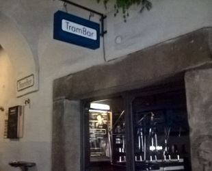

Acknowledgments
---------------

Trambar makes use of the following open source software. Many thanks to contributors of these projects.

### Applications

* [Certbot](https://certbot.eff.org/)
* [Docker](https://www.docker.com/)
* [FFmpeg](https://www.ffmpeg.org/)
* [Nginx](https://www.nginx.com/)
* [Node.js](https://nodejs.org/)
* [PhantomJS](http://phantomjs.org/)
* [PLV8](https://github.com/plv8/plv8)
* [PostgreSQL](https://www.postgresql.org/)

### Build tools

* [Babel](https://babeljs.io/)
* [Cordova](https://cordova.apache.org/)
* [Sass](https://sass-lang.com/)
* [UglifyJS](https://github.com/mishoo/UglifyJS2)
* [Webpack](https://webpack.js.org/)
* [Webpack bundle analyzer](https://github.com/webpack-contrib/webpack-bundle-analyzer)

### Test tools

* [Chai](http://www.chaijs.com/)
* [Enzyme](https://github.com/airbnb/enzyme)
* [Karma](https://karma-runner.github.io/)
* [Mocha](https://mochajs.org/)

### Libraries

* [Bcrypt](https://github.com/kelektiv/node.bcrypt.js)
* [Bluebird](http://bluebirdjs.com)
* [Chartist](https://gionkunz.github.io/chartist-js/)
* [CORS](https://github.com/expressjs/cors)
* [Diff](https://github.com/kpdecker/jsdiff)
* [DNS Cache](https://github.com/yahoo/dnscache)
* [Express](https://expressjs.com/)
* [File-type](https://github.com/sindresorhus/file-type)
* [Font Awesome](https://fontawesome.com/)
* [Hammer](https://hammerjs.github.io/)
* [Ignore](https://github.com/kaelzhang/node-ignore)
* [JS MediaTags](https://github.com/aadsm/jsmediatags)
* [JsDAV](https://github.com/mikedeboer/jsDAV)
* [Lodash](https://lodash.com/)
* [Memoizee](https://github.com/medikoo/memoizee)
* [Moment](https://momentjs.com/)
* [Multer](https://github.com/expressjs/multer)
* [Octicons](https://octicons.github.com/)
* [Parse-diff](https://github.com/sergeyt/parse-diff)
* [Passport](http://passportjs.org/)
* [Piexifjs](https://github.com/hMatoba/piexifjs)
* [PostgreSQL client](https://github.com/brianc/node-postgres)
* [QRCode](https://github.com/soldair/node-qrcode)
* [React](https://reactjs.org/)
* [React Easy Emoji](https://github.com/appfigures/react-easy-emoji)
* [Request](https://github.com/request/request)
* [Sharp](https://github.com/lovell/sharp)
* [SockJS](https://github.com/sockjs)
* [String-similarity](https://github.com/aceakash/string-similarity)
* [XML2JS](https://github.com/Leonidas-from-XIV/node-xml2js)

### Cordova plug-ins

* [Android permission](https://github.com/NeoLSN/cordova-plugin-android-permissions)
* [Android support gradle release](https://github.com/dpa99c/cordova-android-support-gradle-release)
* [Background upload](https://github.com/spoonconsulting/cordova-plugin-background-upload)
* [Camera](https://cordova.apache.org/docs/en/latest/reference/cordova-plugin-camera/)
* [CodePush](https://github.com/Microsoft/cordova-plugin-code-push)
* [Device](https://cordova.apache.org/docs/en/latest/reference/cordova-plugin-device/)
* [File](https://cordova.apache.org/docs/en/latest/reference/cordova-plugin-file/)
* [iOS camera permissions](https://github.com/cordobo/cordova-plugin-ios-camera-permissions)
* [Media capture](https://cordova.apache.org/docs/en/latest/reference/cordova-plugin-media-capture/)
* [Network information](https://github.com/apache/cordova-plugin-network-information)
* [Push](https://github.com/phonegap/phonegap-plugin-push)
* [QR scanner](https://github.com/bitpay/cordova-plugin-qrscanner)
* [Splash screen](https://cordova.apache.org/docs/en/latest/reference/cordova-plugin-splashscreen/)
* [Status bar](https://github.com/apache/cordova-plugin-statusbar)
* [Video editor](https://github.com/jbavari/cordova-plugin-video-editor)
* [WKWebView engine](https://github.com/apache/cordova-plugin-wkwebview-engine);

### Libraries developed for Trambar

* [Async do-while](https://github.com/chung-leong/async-do-while)
* [Mark-Gor](https://github.com/chung-leong/mark-gor)
* [Relaks](https://github.com/chung-leong/relaks)

### Name

Trambar is named after [a bar in Krakow, Poland](https://www.google.com/maps/place/TramBar/@50.0604157,19.9370353,736m/data=!3m2!1e3!4b1!4m5!3m4!1s0x47165b126ab82213:0xe6a13d9ea5df9a7b!8m2!3d50.0604123!4d19.939224).

