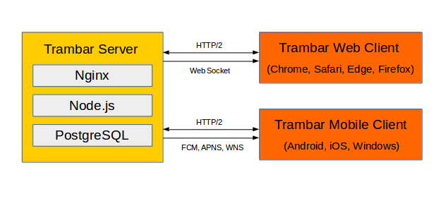
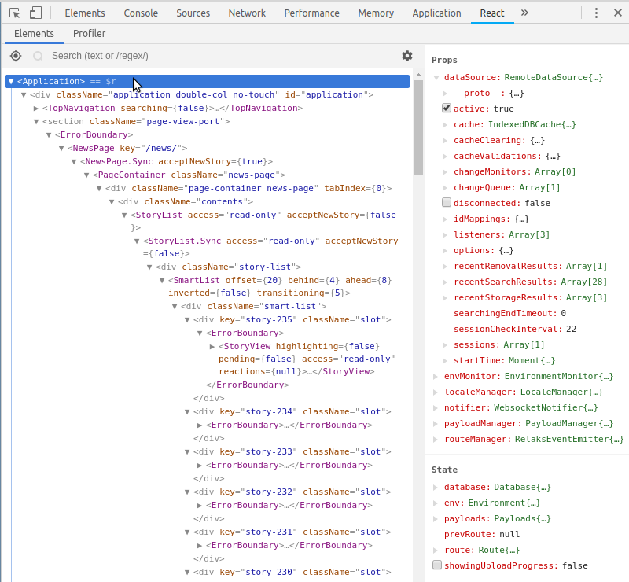
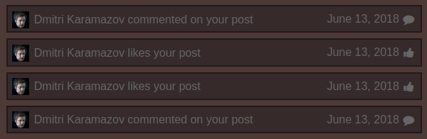
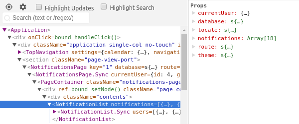
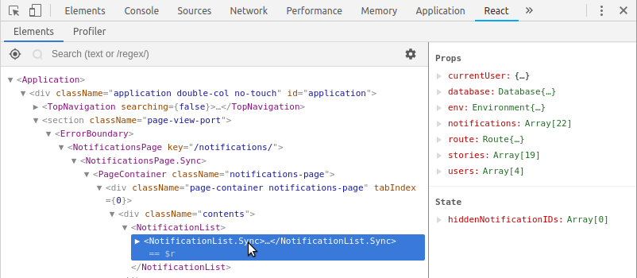

System Architecture
-------------------

* [Trambar subsystems](#trambar-subsystems)
* [Backend details](#backend-details)
* [Frontend details](#frontend-details)

## Trambar subsystems

Trambar Server is composed of [Nginx](https://www.nginx.com/), [PostgreSQL](https://www.postgresql.org/), and scripts running on [Node.js](https://nodejs.org/en/). Trambar Web Client is an HTML5 application based on the [React](https://reactjs.org/) framework.

Trambar Mobile Client runs a variant of the Web Client on [Cordova](https://cordova.apache.org/).



## Backend details

* [Services](#services)
* [Data model](#data-model)
* [Data objects/tables](#data-objects-tables)
* [Data accessors](#data-accessors)
* [Data protection](#data-protection)
* [Change events](#change-events)

### Services

Trambar backend services are Node.js scripts, each running in a separate Docker container:

* **Data Server** - Handles data queries and storage requests. There are two instances of this: one handling requests from the Administrative Console, with elevated access level, and another handling requests from the Web Client.
* **Event Notifier** - Sends database change notifications and alert messages over Web Socket or mobile push services ([APNS](https://developer.apple.com/notifications/), [FCM](https://firebase.google.com/docs/cloud-messaging/),  [WNS](https://docs.microsoft.com/en-us/windows/uwp/design/shell/tiles-and-notifications/windows-push-notification-services--wns--overview)).
* **GitLab Adapter** - Imports data from GitLab.
* **Live-Data Invalidator** - Monitors database for changes and flags affected statistics records and story listings as out-of-date.  
* **Live-Data Updater** - Update records that have been flagged as out-of-date.
* **Media Server** - Handles uploaded media files and perform any necessary conversion. It uses FFMPEG to transcode video files.
* **Schema Manager** - Creates new database schema when new projects are created. It has access to the PostgreSQL root account.
* **Session Manager** - Handles the authentication through OAuth and creation of sessions.

These scripts communicate with the outside world (where necessary) through Nginx. They communicate with each other through PostgreSQL, utilizing its [notification feature](https://www.postgresql.org/docs/9.3/static/libpq-notify.html).

### Data model

Trambar utilizes a denormalized "Less-SQL" data model. While tables are related to each other, joins are generally not done on the server side. Linkage between objects occurs in front-end code instead. Objects are basically stored in the same form as they appear in the front-end. The model is designed with client-side caching in mind. It also permits very fast data retrieval.

Linking tables are not used for many-to-many relationships. These are implemented instead as arrays of integer keys.

For the sake of flexibility, most contents are placed in a JSON column named `details`. Things like names and descriptions are stored here. Resources attached to an object, such as a user's profile picture, are also stored here.

The integer column `gn` holds a generation number. It's incremented every time a row changes (by a database trigger).

The `external` column in certain tables holds an JSON array. Each object points to one or more objects existing on an external server. For example, in a user object, there could be one object pointing to a GitLab account and a second object pointing to a Facebook account:

```json
[
  {
    "type": "gitlab",
    "server_id": 1,
    "user": {
      "id": 2,
      "username": "cleong"
    }
  },
  {
    "type": "facebook",
    "server_id": 2,
    "user": {
      "id": "10155468403650846"
    }
  }
]
```

In a [note reaction](user-manual.md#note) concerning a comment on an issue in GitLab, meanwhile, the array will look as follows:

```json
[
  {
    "type": "gitlab",
    "server_id": 1,
    "note": {
      "id": 185
    },
    "issue": {
      "id": 56,
      "number": 3
    },
    "project": {
      "id": 2
    }
  }
]
```

The external IDs, combined with the server record, make it possible to construct a URL to the GitLab comment.

A column with similar structure, `exchange`, is used to sync information between the internal object and the external object.

### Data objects/tables

* [Global objects](#global-objects)
* [Project-specific objects](#project-specific-objects)

#### Global objects

* commit - Represents a Git commit. Contains only stats about the commit (number of files/lines added, etc.).
* device - Represents a mobile device.
* picture - Represents a picture in the picture album available in the Administrative Console.
* project - Represents a Trambar project. Contains name and description, list of project members, list of repositories associated with project, and other settings.
* repo - Represents a GitLab repository. Contains list of users who have access to the repository.
* server - Represents an external server such as GitLab.
* session - Represents a user session.
* subscription - Contains information need for change notification by Web Socket or mobile push.
* system - Contains system information and settings. Only a single one exists.
* task - Represents a system task. Contains progress information and details of the task's outcome.
* user - Represents an end-user. Contains personal information, contact information, role assignments, and user settings.

#### Project-specific objects

* bookmark - Represents a [bookmark](user-manual.md#bookmarks).
* listing - Contains the outcome of the [story selection process](user-manual.md#story-selection).
* notification - Represents a [notification](user-manual.md#notifications).
* reaction - Represents a [reaction](user-manual.md#reaction-types).
* statistics - Contains statistical information about stories and notifications.
* story - Represents a [story](user-manual.md#story-types).
* task - Represents a user-initiated task such as uploading of a media file. Contains progress information and details of the task's outcome.

### Data accessors

A data accessor is simply a bundle of functions for working with data in a particular table. The following are some keys functions:

* `create()` - Creates the table and its indices
* `watch()` - Adds triggers to the table
* `find()` - Finds matching rows
* `insert()` - Inserts new rows
* `update()` - Updates existing rows
* `import()` - Accepts remotely supplied data, applies access control (write), error check, and other possible adjustments
* `export()` - Strips out data needed only by back-end code, applies access control (read) and other possible adjustments
* `isRelevantTo` - Checks if a change event involves an object that can be seen by a given user

### Data protection

Data access in Trambar is compartmentalized to reduce the risk of leaking sensitive information. There PostgreSQL roles are used to provide different access levels. The following table lists the roles and the tables they can access:

| Role            |                                                          |
|-----------------|----------------------------------------------------------|
| client_role     | bookmark, commit (RO), device, listing, notification, project, reaction, repo (RO), role (RO), statistics, story, subscription, system (RO), task, user |
| admin_role      | bookmark, commit, device, listing, notification, picture, project, reaction, repo, role, statistics, story, server, subscription, system, task, user |
| auth_role       | device, project (RO), server, session, system (RO), user |

Each Trambar backend service is assigned one of the above roles, with the exception of **Schema Manager**, which needs root level access:

| Service                | Role               |
|------------------------|--------------------|
| Schema Manager         | root               |
| Admin Data Server      | admin_role         |
| GitLab Adapter         | admin_role         |                      
| Data Server            | client_role        |
| Media Server           | client_role        |
| Event Notifier         | client_role        |
| Live Data Invalidator  | client_role        |
| Live Data Updater      | client_role        |
| Session Manager        | auth_role          |

### Change events

A change events is broadcasted whenever a row is inserted, updated, or deleted. It's a plain object containing the following properties:

* `op` - The operation performed ('INSERT', 'UPDATE', or 'DELETE')
* `table` - The table that was altered
* `schema` - The schema containing the said table
* `id` - The primary key of the row
* `gn` - The current generation number
* `diff` - An object containing the columns that were changed
* `current` - An object containing the current values of selected columns
* `previous` - An object containing the previous values of selected columns--if they're different from the current values

Only the values of critical columns are included in the event object. The columns are specified as parameters to the trigger function.

Trambar services that do not accept requests directly from the front-end code are dependent on change events triggered by those that do. For example, when a user publishes a new post, the client sends a storage request to **Data Server**. **Live-Data Invalidator** then receives a notification about the operation on the `story` table. It marks certain rows in the `statistics` and `listing` table as "dirty", meaning not up-to-date. **Live-Data Updater** in turns receives notifications about these changes and proceed to update the dirty rows.

## Frontend details

* [Basic structure](#basic-structure)
* [Bootstrap sequence](#bootstrap-sequence)
* [Data sources](#data-sources)
* [Propagating changes](#propagating-changes)
* [Asynchronous operations](#asynchronous-operations)
* [Data queries](#data-queries)
* [Debugging frontend code](#debugging-frontend-code)

## Basic structure

Trambar Web Client is based on React. The React component tree is the app's main structure. Using React's [Chrome](https://chrome.google.com/webstore/detail/react-developer-tools/fmkadmapgofadopljbjfkapdkoienihi?hl=en) or [Firefox browser extension](https://addons.mozilla.org/en-US/firefox/addon/react-devtools/), you can easily examine the running state of most parts of Trambar.



## Bootstrap sequence

1. After HTML page load event triggers bootstrap function ([main.js](https://github.com/chung-leong/trambar/blob/master/client/src/main.js))
2. External libraries ([libraries.js](https://github.com/chung-leong/trambar/blob/master/client/src/libraries.js)) are asynchronously loaded, along with application code
3. AppCore ([app-core.js](https://github.com/chung-leong/trambar/blob/master/common/src/app-core.js)) initiates data sources
4. `<Application />` is rendered, with props returned by AppCore ([application.jsx](https://github.com/chung-leong/trambar/blob/master/client/src/application.jsx))

## Data sources

AppCore is responsible for initiating data sources used by the application. It sets up the basic plumbing underlying the React UI code. It's used by both the Web Client and the Administrative Console.

Data sources are classes that provide data. There are five of them:

* `RemoteDataSource` - Handles data retrieval from and storage to a database on a remote server ([remote-data-source/index.js](https://github.com/chung-leong/trambar/blob/master/common/src/data/remote-data-source/index.js))
* `RouteManager` - Maps the current URL to a page component ([relaks-route-manager](https://github.com/chung-leong/relaks-route-manager))
* `LocaleManager` - Provides text used in the user interface in different languages ([locale-manager.js](https://github.com/chung-leong/trambar/blob/master/common/src/locale/locale-manager.js))
* `PayloadManager` - Handles file uploads ([payload-manager.js](https://github.com/chung-leong/trambar/blob/master/common/src/transport/payload-manager.js))
* `EnvironmentMonitor` - Monitors the operating environment ([environment-monitor.js](https://github.com/chung-leong/trambar/blob/master/common/src/env/environment-monitor.js))

Each data source is wrapped by a proxy objects:

* `RemoteDataSource` -> `Database` ([database.js](https://github.com/chung-leong/trambar/blob/master/common/src/data/database.js))
* `RouteManager` -> `Route` ([route.js](https://github.com/chung-leong/trambar/blob/master/common/src/routing/route.js))
* `LocalManager` -> `Locale` ([locale.js](https://github.com/chung-leong/trambar/blob/master/common/src/locale/locale.js))
* `PayloadManager` -> `Payloads` ([payloads.js](https://github.com/chung-leong/trambar/blob/master/common/src/transport/payloads.js))
* `EnvironmentMonitor` -> `Environment` ([environment.js](https://github.com/chung-leong/trambar/blob/master/common/src/env/environment.js))

These proxy objects are passed as props to nearly every single component in Trambar. They expose functionalities that can be utilized by components to obtain necessary data and perform actions, such as navigating to a different page or saving data to the remote database. They also act as signals that changes have occurred and updates to the user interface are necessary.

For convenience’s sake, `Locale` is stored inside `Environment`.

## Propagating changes

The five aforementioned data sources all emit the `change` event:

`RemoteDataSource` fires the event when it receives a change notification from the remote server--and also after it has performed authentication or storage operations.

`RouteManager` fires the event when the user has navigated to a different part of the app (by clicking a hyperlink, for instance).

`LocaleManager` fires the event when the UI language is changed.

`PayloadManager` fires the event when progress has been made in uploading a file

`EnvironmentMonitor` will fire the event whenever the browser environment changes in some way (e.g. resizing of the browser window).

In each case, `Application` responds by creating a new instance of the component's proxy object. This behavior is tailored for the typical response of React components' `shouldComponentUpdate` method. So called pure components don't perform any work unless they receive new props. When a prop is an object, only a shallow comparison is done usually. Creation of new proxy objects is designed specifically to trip this detection mechanism.

## Asynchronous operations

Of the five data sources described above, four are able to readily provide new information. Once a route change has occurred, `RouteManager` knows what the current route is. If a component needs the route parameters, it can get them immediately (they're stored in the `Route` object). Likewise, once `LocaleManager` has loaded a phrase dictionary, any component that needs a particular phrase while rendering will receive it immediately through a synchronous method.

`RemoteDataSource` is rather different as the operations it performs are inherently asynchronous. It takes time to retrieve data from a database. It takes time to transfer that data across the Internet. When a component asks for data needed to render itself, it must wait for it to arrive.

Trambar deals with asynchronousity with the help of [Relaks](https://github.com/chung-leong/relaks), a small library that allows a React component to implement an asynchronous render method. In lieu of a `ReactElement`, the method returns a [promise](https://promisesaplus.com/) of a `ReactElement`.

Such a component is implemented as an asynchronous-synchronous pair. The asynchronous half retrieves the necessary data then hands that data to its synchronous half. A relatively simple example is *NotificationList* ([notification-list.jsx](https://github.com/chung-leong/trambar/blob/master/client/src/lists/notification-list.jsx)). It accepts a list of notification objects and displays them:





A notification object does not have all the necessary information. It lacks, for instance, the name of the user who triggered the notification. It only has the user ID. The user record must be retrieved so his name and profile picture can be shown. This is done in *NotificationList*'s `renderAsync()` method:

```javascript
renderAsync(meanwhile) {
    let {
        database,
        route,
        env,
        currentUser,
        notifications,
    } = this.props;
    let db = database.use({ by: this });
    let props = {
        users: undefined,
        stories: undefined,

        currentUser,
        notifications,
        database,
        route,
        env,
    };
    meanwhile.show(<NotificationListSync {...props} />);
    return db.start().then((userID) => {
        return UserFinder.findNotificationTriggerers(db, props.notifications).then((users) => {
            props.users = users;
        });
    }).then(() => {
        meanwhile.show(<NotificationListSync {...props} />);
        return StoryFinder.findStoriesOfNotifications(db, props.notifications, props.currentUser).then((stories) => {
            props.stories = stories;
        });
    }).then(() => {
        return <NotificationListSync {...props} />;
    })
}
```

`NotificationListSync` is a standard React component that draws the list's UI. It accepts a superset of `NotificationList`'s props. In addition to a list of notifications, it wants a list of users as well as the stories referenced by the notification objects:



These objects will be absent initially. The component makes the best effort with what it's given. Without a name it cannot formulate a proper sentence. It can, however, render the frame so the user would see that something is there.

The *StoryList* component works in the same way, only that its synchronous companion requires many more related objects ([story-list.jsx](https://github.com/chung-leong/trambar/blob/master/client/src/lists/story-list.jsx)). In addition to the stories' authors, it wants the reactions to the stories, as well as the users who reacted. It also wants bookmarks to the stories and their recipients. As these objects are retrieved, `renderAsync()` calls `meanwhile.show()` to rerender *StoryListSync* with new data added to the props. This progressive rendering mechanism means the end user will see the story list immediately, even through retrieval of all necessary data could take a second or two.

### Data queries

Data queries occurs in two stages. In the discovery stage, client sends the query and the server responds with a list of ids and generation numbers (gn) of matching objects. In the retrieval stage, the client sends the ids of objects that are out-of-date or absent from the local cache.

### Debugging frontend code

First, clone the [Trambar repo](https://github.com/chung-leong/trambar) at GitHub. Then run `npm install` in the sub-folders `common`, `client`, and `admin`.

To debug the Web Client, run `npm run start` in `client`. This will launch [WebPack DevServer](https://webpack.js.org/configuration/dev-server/). Open a browser window and navigate to http://localhost:8080/https/live.trambar.io/. Replace the domain name in the URL if you wish to use a different backend.

To debug the Administrative Console, run `npm run start` in `admin` and navigate to http://localhost:8088/https/live.trambar.io/admin/ instead. Note the different port number.
