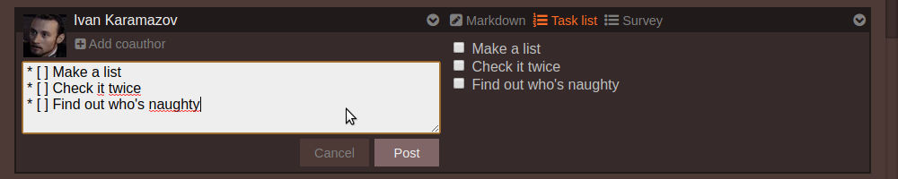
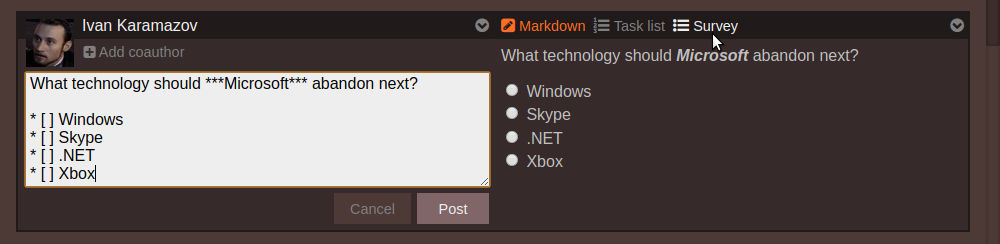
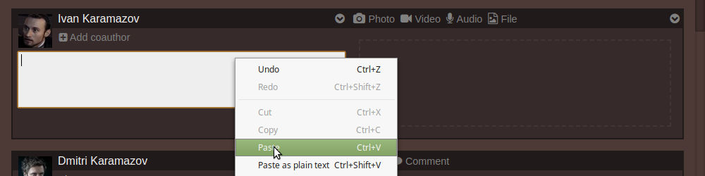
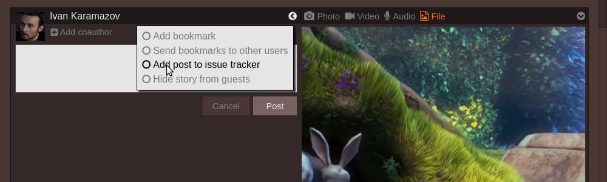
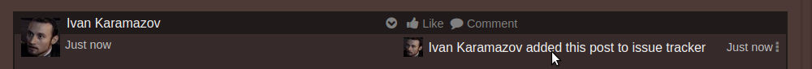
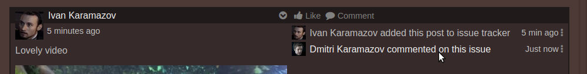
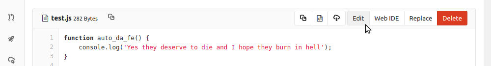

Demo
====

You can see Trambar in action at the [Trambar project's own trambar](https://live.trambar.io/). To sign in, use one of the following GitLab external accounts:

Username: **dmitri**  
Password: `BagOfNuts`

Username: **ivan**  
Password: `GrandInquisitor`

Username: **alyosha**  
Password `StinkingMonk`

If you so choose, you can sign up using your GitHub or Facebook account. The Demo project is set to automatically approve membership requests. You will not have access to the git repo associated with the project, however.

## Administrative console

You can access the [Administrative Console](https://live.trambar.io/admin/) using one of the guest accounts. Normally, only administrators can sign into the console. For demo purpose this check is disabled. Any attempt to change anything will result in an error (or so it should).

## Mobile clients

To install the Trambar mobile app, go to the Apple, Google, or Windows app store and search for ***trambar***. When installation is complete, use the web browser on your desktop computer to sign into Trambar. Choose a project then go to **Settings**. Under **Projects** click the ***mobile set up*** link. A QR code will appear. Scan the QR code using the Trambar app on your phone to gain access.

## Suggested activities

### Create a task list

A task list lets other people know what you're doing at the moment. You can quickly start one by typing the sequence `*[]`. That'll automatically expand to `* [ ]`. A preview of the list will also be automatically activated:

### Create a survey

A survey lets you query your colleagues' opinions. You can create one in the same manner as a task list. You just need to click the survey icon to switch the story type:

### Quickly add a screen-shot

Press the **PrtScn** key on your keyboard to take a snapshot of your screen. It'll get placed in the clipboard. Now right-click the text editor and select **Paste**.

The screen-shot will get added to the story. Use your mouse-wheel to zoom into a particular area.

### Record a live video

If your computer has a webcam and you're using Chrome or Firefox, you can attach a live video to a story. Simply click the video camera icon:

Grant permission to use the camera and you should start seeing yourself as captured by your webcam. Click **Start** to begin recording. Click **Stop** to end it. Click **Accept** to close the dialog box. Afterward, you can adjust the preview image with your mouse.

### Open an issue with a video

First, attach a video to a story. Then open the first pop-up menu and select **Add post to issue tracker**:

**Note:** Story options are not hidden in a menu when the browser window is wide enough.

Enter an issue title and select a label. Click **OK** to close the dialog box, then **Post** to publish the post. After a brief moment you'll see a message indicating the issue's been created. Click on it will send you to the GitLab issue page:

You can also export other people's posts to the issue tracker. The idea is that an end user of your software would record what he thinks is a bug using his smart-phone then share the video on Trambar. After reviewing it, a programmer could then decide that it does in fact depict a bug and choose to log the video evidence.

### Comment on an issue

Add a comment to the issue you've just created in GitLab. A message stating that fact will appear in the comment section in Trambar:

The text will link to the issue page for users with Git access. Users without Git access will merely know that the issue is talked about.

### Perform a push

In a different browser tab, navigate to the Trambar project's [GitLab server](https://gitlab.trambar.io/). If you're not logged in as one of the demo users already, do so. Go to the project [demo-1](https://gitlab.trambar.io/demo/demo1). Select a file and click the edit button:

Make some changes and commit them. A few seconds later a new story will appear in the Trambar newsfeed.
