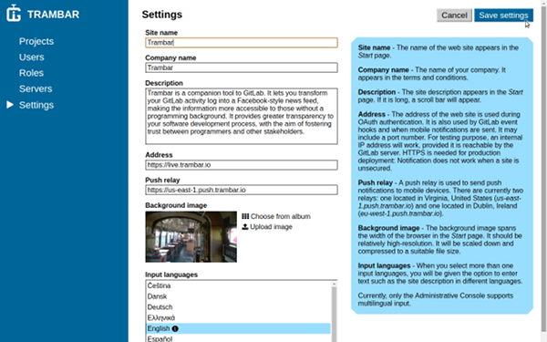
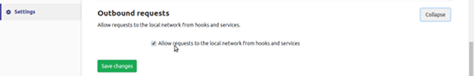
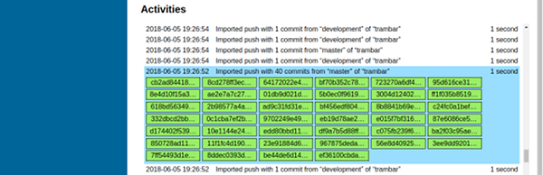
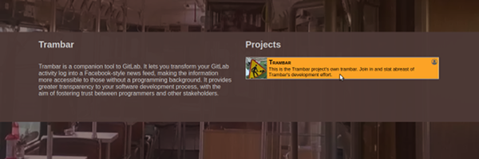

Getting Started
===============

Trambar Server is a [Docker](https://www.docker.com/) app. Installation and updates are managed by a [CLI utility](https://github.com/trambarhq/trambar-cli).

* [Prerequisite](#prerequisite)
* [Installation on Linux](#installation-on-linux)
* [Installation on OSX and Windows](#installation-on-osx-and-windows)
* [Setting up server](#setting-up-server)
* [Creating first project](#creating-first-project)

## Prerequisite

For production deployment, you'll need a server connected to the Internet with a valid domain name. Trambar Server is designed to run in the Cloud. A virtual machine with 2G of RAM and 16G of disk space should suffice, with the latter figure dependent on the amount of video contents expected.

You'll also need administrative access to a GitLab server.

For evaluation on your own computer, you should create a test instance of GitLab CE. The easiest method is with [Docker Compose](https://docs.gitlab.com/omnibus/docker/#install-gitlab-using-docker-compose).

## Installation on Linux

1. Install **npm** if it's not a default part of the distro you're using.

2. Install **trambar-cli**:

   `sudo npm install -g trambar`

3. Start the installation process:

   `sudo trambar install`

4. Choose whether you wish to use SSL:

   > Set up SSL? [Y/n]

   For a production server, SSL is mandatory. Certain browser features (related to notification and video recording) do not work on an unsecured page. You should choose yes even if you're only evaluating Trambar on your own computer.

   If you choose yes, the installation script will ask if you wish to use
   **certbot**:

   > Use certbot (https://certbot.eff.org/)? [Y/n]

   Answer yes if you do not have an SSL certificate for the server's domain name.

   If you choose no, the script will ask if you wish to use a self-signed SSL certificate:

   > Use self-signed SSL certificate? [Y/n]

   Answer yes if you're evaluating the software on your computer. The use of a "snakeoil" certificate will lead to a browser warning, but all parts of the web client will function correctly. Answer no if you're employing your own SSL certificate.

5. Enter the server's domain name:

   > Server domain name:

6. If you have chosen to use certbot, you'll be asked to provide a contact e-mail address:

   > Contact e-mail:

   [Let's Encrypt](https://letsencrypt.org/) will send e-mail concerning the SSL certificate (e.g. expiration warning) to this address.

   Otherwise, if you have not chosen the self-signed certificate, you'll be prompted for the location of your SSL certificate and its private key:

   > Full path of certificate:  
   > Full path of private key:

7. Choose the ports for HTTP and HTTPS:

   > HTTPS port: [443]  
   > HTTP port: [80]

8. Choose a password for the root account:

   > Password for Trambar root account:

9. Wait while the installation script install Docker and retrieve Trambar's images from [Docker Hub](https://hub.docker.com/u/trambar/dashboard/). The process should take a minute or two on a cloud-based server with high Internet bandwidth.

10. Start Trambar server:

    `sudo trambar start`

Configuration files are stored in `/etc/trambar/`. The hidden file `.env` contains all parameters. `docker-compose.yml` contains the container orchestration setup. It makes use of variables defined in `.env`. Depending on choices made during installation, certain lines will be commented out.

`.htpasswd` holds the root account password. The password is needed during initial system setup. Once a GitLab server is paired with Trambar, you may choose to delete this file and sign into the Administrative Console exclusively through OAuth.

By default, the database is stored in `/srv/trambar/postgres/` while media files are stored in `/srv/trambar/media/`. When deploying to a cloud server, it's advisable to mount a low-cost magnetic volume at this latter location.

## Installation on OSX and Windows

The procedures for installing Trambar on OSX and Windows are nearly the same as doing so on Linux. You will need to install Docker manually. You do not need to run the CLI utility with elevated privilege (i.e. no sudo).

Configuration files will be placed in a folder called "Trambar" in your home folder. Media files and database will reside in Docker volumes. Mapping to host folders is not done on OSX and Windows as it's not entirely reliable.

Since Docker runs in a virtual machine on OSX and Windows, you might need to configure port-forwarding to make the server reachable from your computer. You might also need to increase the amount of memory available to the Docker VM.

## Setting up server

1. Open a web browser and navigate to the URL of the Trambar Administrative Console: `https://<domain-name>/admin/`. Be sure to include the trailing slash. Initial loading of the page could take five to ten seconds as nothing is yet cached.

2. In the sign-in page, enter *root* as the user name and the password you had chosen earlier. Click the **Sign in** button.

   

3. You should find yourself in the **Settings** page. If not, click **Settings** in the left navigation pane, then the **Edit settings** button in the upper-right-hand corner.

4. Enter information about your server and ensure that its web address is correct. Then choose a background image. It'll appear in the start page of the web client. Click the **Save settings** button when you're done.

   

5. Click **Servers** in the left navigation pane.

   

6. Click the **Add new server** button in the upper-right-hand corner.

   

7. Select *GitLab* as the server type.

   

8. In a different browser window, sign into GitLab using an account with administrative privilege.

9. Navigate to the **Admin area**.

   

10. Click **Applications** in the left navigation pane.

    

11. Click the **New application** button.

    

12. Enter *Trambar* as the application's name, then copy the **Redirect URI** from Trambar Administrative Console into the corresponding boxes here. Select **api** and **read_user** as the application's scope, the click the **Submit** button.

    

    

13. Copy the **Application id** and **Application secret** from GitLab into the corresponding boxes in Trambar Administrative Console.

    

    

14. Copy the URL of the GitLab server into the corresponding box in Trambar Adminstrative Console.

    

    The URL should contains only the domain name (and possibly a port number).

15. Indicate how you wish to map users from GitLab to Trambar.

    

    A typical setup is to map GitLab administrator to Trambar administrator, GitLab regular user to Trambar regular user, and GitLab external user to Trambar guest. Users can be promoted to more privileged user type on a case by case basis.

16. Click the **Save server** button.

    

17. Click the **Acquire API access** button.

    

18. A GitLab pop-up window will appear. Click the **Authorize** button, then close the window when it says *OK*.

    

At this point, **API Access** should have changed to *Administrative access acquired*. You should also see entries in the activity log about repositories and users imported into the system.

If you're using a local instance of GitLab 11, be sure the server permits outbound requests to the local network. Otherwise Trambar will not be able to install project hooks (for monitoring events). You'll find the checkbox in **Admin Area** > **Settings** > **Outbound requests**.

## Creating first project

1. Click **Projects** in the left navigation pane.

2. Click the **Add new project** button.

   

3. Enter a project name and description. Select an image as the project emblem. Choose whether users can request to join the project and whether non-members can view its contents. Click the **Save project** button when you're done.

   

4. Click **Repositories** in the left navigation pane.

   

5. Click the **Edit repository list** button.

   

6. All repositories imported from GitLab will appear. Click the name of each repo you wish to associate with the project. Click the **Save repository list** button when you're done.

   

7. Trambar will begin to import past activities from the chosen repo(s). The process could take a long time if a repo has a long history. You can monitor its progress in the project summary page. The activity chart will update itself in real time as stories as created.

   

   You can also monitor import progress from the server summary page. Simply click the status bar at the bottom of the page. The activity log will show what's happening in real time. Click on an entry to expand it.

   

   Once everything is imported, the status bar will retract.

8. Open a new browser tab and navigate to the URL of the Web Client: `https://<domain-name>`. Click the **GitLab** button.

   

9. A pop-up window will appear. Sign into GitLab if you have not already done so. Then click the **Authorize** button. If you do not see an authorization prompt, close the window and try again.

   

10. The pop-up window should close automatically once authorization is granted. In the Web Client, you should see the project you have just created. Click on it to enter the project.

    

Trambar automatically grants memberships to GitLab users with access to the repo(s) associated with a project (with the exception of the root user). Members are listed in the [People](user-guide.md#people) page.

Administrators have full access to all projects, including the ones where they are not members.
