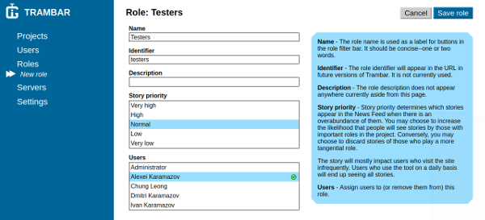
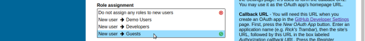
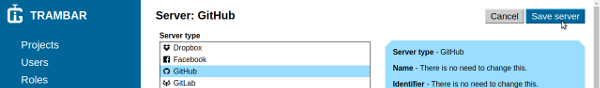

Trambar User Guide - Administrative Console
-------------------------------------------

* [Sign in](#sign-in)
* [Projects](#projects)
* [Members](#members)
* [Repositories](#repositories)
* [Users](#users)
* [Roles](#roles)
* [Servers](#servers)
* [Settings](#settings)

## Sign in

* [Signing in using password](#signing-in-using-password)
* [Signing in using OAuth](#signing-in-using-oauth)
* [Signing off](#signing-off)

### Signing in using password

1. Enter user name and password.

2. Click the **Sign in** button.

   

### Signing in using OAuth

1. Click the **GitLab** button.

   

2. A GitLab pop-up window will appear. If you're not currently signed into
   GitLab, you're be asked to provide your credentials. Afterward, you'll be
   asked you to grant authorization to Trambar. Click the **Authorize** button.

   

   The window may close itself immediately if Trambar is set as a trusted
   application and you're already signed in.

### Signing off

1. Click the user icon at the bottom of the left navigation, then **Sign off**.

   

## Projects

* [Adding a new project](#adding-a-new-project)
* [Archiving old projects](#archiving-old-projects)
* [Deleting a project](#deleting-a-project)
* [Restoring a project](#restoring-a-project)

### Adding a new project

1. Click **Projects** in the left navigation.

   

2. Click the **Add new project** button.   

   

3. Enter the name and description of the project. Choose a project emblem.
   Indicate how new members are added and whether non-members may view the
   project's news feed.

   

4. Click the **Save project** button.

   

### Archiving old projects

1. Click **Projects** in the left navigation.

   

2. Click the **Edit project list** button.

   

3. The list will expand to show all projects, including those archived or
   deleted earlier. Click the name of each project that you wish to archive.

   

4. Click the **Save project list** button.   

   

### Deleting a project

1. Click **Projects** in the left navigation.

   

2. Click the name of the project you wish to delete.

   

3. Click the arrow beside the gray button, then **Delete project**.

   

If you delete a project by mistake, use the browser's back button to return to
the page and click the **Restore project** button.  

### Restoring a project

1. Click **Projects** in the left navigation.

   

2. Click the **Edit project list** button.

   

3. The list will expand to show all projects, including those archived or
   deleted earlier. Click the name of each project that you wish to restore.

   

4. Click the **Save project list** button.   

   

## Members

* [Approving membership requests](#approving-membership-requests)
* [Rejecting membership requests](#rejecting-membership-requests)
* [Adding existing users](#adding-existing-users)
* [Adding a new member](#adding-a-new-member)
* [Removing members](#deleting-members)

### Approving membership requests

1. Click **Projects** in the left navigation pane.

   

2. Click the name of the project.

   

3. Click **Members** in the left navigation pane.

  

4. If there are unapproved requests, certain users will appear grayed out in
   the list. The **Approve all requests** button will be preselected. Click it
   to approve all requests.

   

If you wish to add only some of the users, follow the [instructions for
adding users](#adding-existing-users) instead.

### Rejecting membership requests

1. Click **Projects** in the left navigation pane.

   

2. Click the name of the project.

   

3. Click **Members** in the left navigation pane.

  

4. If there are unapproved requests, certain users will appear grayed out in
   the list. The **Approve all requests** button will be preselected. Click the
   arrow beside it, then click **Reject all requests**.

   

### Adding existing users

1. Click **Projects** in the left navigation pane.

   

2. Click the name of the project.

   

3. Click **Members** in the left navigation pane.

   

4. Click the **Edit member list** button.

   

5. The list will expand to show all users. Click the name of each user that you
   wish to add.

   

6. Click the **Save member list** button.   

   

### Adding a new member

1. Click **Projects** in the left navigation pane.

   

2. Click the name of the project.

   

3. Click **Members** in the left navigation pane.

   

4. Click the arrow beside the gray button, then **Add new member**.

   

5. Enter the new member's personal information. Select a profile image. Choose
   the user type and role.

   

6. Click the **Save member** button.

   

### Removing members

1. Click **Projects** in the left navigation pane.

   

2. Click the name of the project.

   

3. Click **Members** in the left navigation pane.

   

4. Click the **Edit member list** button.

   

5. The list will expand to show all users. Current members will be highlighted.
   Click the name of each member that you wish to remove.

   

6. Click the **Save member list** button.   

   

## Repositories

* [Adding repositories to project](adding-repositories)
* [Removing repositories](removing-repositories)

### Adding repositories to project

1. Click **Projects** in the left navigation pane.

   

2. Click the name of the project.

   

3. Click **Repositories** in the left navigation pane.

   

4. Click the **Edit role list** button.

   

5. The list will expand to show all repositories. Click the name of each repo
   you wish to associate with the project.

   

6. Click the **Save repository list** button.   

   

### Removing repositories

1. Click **Projects** in the left navigation pane.

   

2. Click the name of the project.

   

3. Click **Repositories** in the left navigation pane.

   

4. Click the **Edit role list** button.

   

   The list will expand to show all repositories.

5. Click the name of each repo you wish to remove.   

   

6. Click the **Save repository list** button.   

   

## Users

* [Adding a new user](#adding-a-new-user)
* [Deactivating users](#deactivating-a-users)
* [Deleting a user](#deleting-a-user)
* [Restoring users](#restoring-users)

### Adding a new user

1. Click **Users** in the left navigation pane.

   

2. Click the **Add new user** button.   

   

3. Enter the new user's personal information. Select a profile image. Choose
   the user type and role.

   

4. Click the **Save user** button.

   

### Deactivating users

1. Click **Users** in the left navigation pane.

   

### Deleting a user

1. Click **Users** in the left navigation pane.

   

2. Click the name of the user you wish to delete.

   

3. Click the arrow beside the gray button, then **Delete user account**.

   

### Restoring users

1. Click **Users** in the left navigation pane.

   

2. Click the **Edit user list** button.

   

3. The list will expand to show all users, including those who were deactivate
   or deleted earlier. Click the name of each user you wish to restore.

   

4. Click the **Save user list** button.

   

## Roles

* [Adding a new role](#adding-a-new-role)
* [Disabling roles](#disabling-roles)
* [Deleting a role](#deleting-a-role)
* [Assigning a role to users](#assigning-a-role-to-users)

### Adding a new role

1. Click **Roles** in the left navigation.

   

2. Click the **Add new role** button.   

   

3. Enter the name and description of the role. Select a story priority. Finally,
   choose the users to whom you wish to assign the new role.

   

4. Click the **Save role** button.

   

### Disabling roles

1. Click **Roles** in the left navigation.

   

2. Click the **Edit role list** button.

   

3. The list will expand to show all roles, including those disabled or deleted
   earlier. Click the name of each role you wish to disable.

   

4. Click the **Save role list** button.

   

### Deleting a role

1. Click **Roles** in the left navigation.

   

2. Click the name of the role you wish to delete.

   

3. Click the arrow beside the gray button, then **Delete role**.

   

If you delete a role by mistake. Use the browser's back button to return to the
page and click the **Restore role** button.

### Assigning a role to users

1. Click **Roles** in the left navigation.

   

2. Click the name of the role you wish to assign.

   

3. Click the **Edit role** button.

   

4. Under **Users**, click the name of each user to whom you wish to assign the
   role.   

   

5. Click the **Save role** button.

   

### Assigning a role automatically to new users   

1. Click **Servers** in the left navigation.

   

2. Click on the name of the server whose users should be assigned the role.

   

3. Click the **Edit server button**

   

4. Under **Role assignments**, click the role that will be assigned to new users
   from the server.

   

5. Click the **Save server** button.

   

### Removing users from a role

1. Click **Roles** in the left navigation.

   

2. Click the name of the role you wish to assign.

   

3. Click the **Edit role** button.

   

4. Under **Users**, click the name of each user you wish to remove from the
   role.   

   

5. Click the **Save role** button.

   

## Servers

* [Adding a GitLab server](#adding-a-gitlab-server)
* [Adding Dropbox](#adding-dropbox)
* [Adding Facebook](#adding-facebook)
* [Adding GitHub](#adding-github)
* [Adding Google+](#adding-google)
* [Adding Windows Live](#adding-windows-live)

### Adding a GitLab server

### Adding Dropbox

### Adding Facebook

### Adding GitHub

### Adding Google+

### Adding Windows Live

### Disabling server

## Settings

* [Changing background image](#changing-background-image)
* [Changing site description](#changing-site-description)
* [Providing site descriptions in anther language](#providing-site-description-in-anther-language)

### Changing background image

1. Open a new browser window and sign into the Trambar web client. This will
   allow you see to changes as soon as you save them.

2. Click **Settings** in the left navigation.

   

3. Click the **Edit settings** button.

   

4. Under **Background image**, click either **Upload image** or **Choose from
   album** and select an image.

   

5. Click the **Save settings** button.

   

6. Check the appearance of the web client in the other browser window. If you're
   not satistfied with it, click the **Edit settings** button again.

### Changing site description

1. Open a new browser window and sign into the Trambar web client. This will
   allow you see to changes as soon as you save them.

2. Click **Settings** in the left navigation.

   

3. Click the **Edit settings** button.

   

4. Edit the text in the text box under **Description**. If you're text text from
   elsewhere, be sure there aren't any stray newlines.

   

5. Click the **Save settings** button.

   

6. Check the appearance of the web client in the other browser window. If you're
   not satisfied with it, click the **Edit settings** button again.

### Providing site description in anther language

1. Click **Settings** in the left navigation.

   

2. Click the **Edit settings** button.

   

3. Under **Languages**, click the language you wish to add.

   

4. Under **Description**, click the language that you added.

   

5. Type or paste in the description in the chosen language.

   

   Place the mouse cursor over the primary language to see the description in
   that language:

   

6. Provide a site name in the new language if it's different.

7. Click the **Save settings** button.

   

You will now be able to enter project descriptions in the new language as well.
