Trambar User Guide - Administrative Console
-------------------------------------------

* [Sign in](#sign-in)
* [Projects](#projects)
* [Members](#members)
* [Repositories](#repositories)
* [Users](#users)
* [Roles](#roles)
* [Servers](#servers)
* [Settings](#settings)

## Sign in

* [Signing in using password](#signing-in-using-password)
* [Signing in using OAuth](#signing-in-using-oauth)
* [Signing off](#signing-off)

### Signing in using password

The first time you sign into the Administrative Console, you must use the root password provided during installation. Once Trambar is linked to a GitLab server, you can sign in using OAuth instead.

1. Enter user name and password.

2. Click the **Sign in** button.

   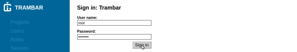

To reset the root password, run `sudo trambar password`.

### Signing in using OAuth

The option to sign in thru OAuth will become available once a GitLab server is added.

1. Click the **GitLab** button.

   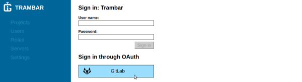

2. A GitLab pop-up window will appear. If you're not currently signed into GitLab, you'll be asked to provide your user credentials. Afterward, you'll be asked you to grant authorization to Trambar. Click the **Authorize** button.

   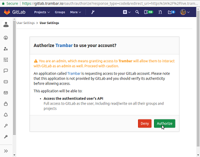

   The window may close itself immediately if Trambar is set as a trusted application and you're already signed in.

### Signing off

1. Click the user icon at the bottom of the left navigation, then **Sign off**.

   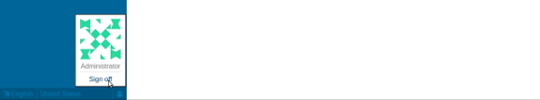

## Projects

* [Adding a new project](#adding-a-new-project)
* [Archiving old projects](#archiving-old-projects)
* [Deleting a project](#deleting-a-project)
* [Restoring archived or deleted projects](#restoring-archived-or-deleted-projects)

### Adding a new project

1. Click **Projects** in the left navigation pane.

   

2. Click the **Add new project** button.   

   

3. Enter the name and description of the project.

   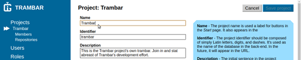

   The project identifier will be derived automatically from the name, unless
   you're writing in a non-Latin script.

4. Choose a project emblem.

   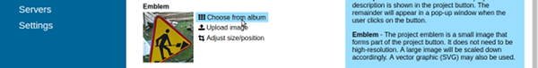

5. Indicate how new members are added.

   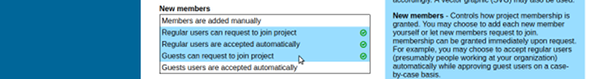

   Generally it's easier to let users ask for membership. You can always reject those you wish to keep out.

   Automatically granting membership to regular users is sensible when your organization is small and you can trust everyone. It spares the administrator the task of approving each new member.

   Automatically granting membership to guests is sensible only when guest access is tightly controlled--for instance, when only GitLab external users can become guests.

6. Indicate whether non-members may view the project's news feed.

   

7. Click the **Save project** button.

   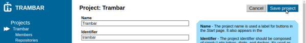

### Archiving old projects

Archiving a project makes it read-only. People will no longer be able to publish posts to its news feed. It will also disappear from the [Start](user-guide.md#start---web-browser) page. An archived project can be reactivated later on.

1. Click **Projects** in the left navigation pane.

   

2. Click the **Edit project list** button.

   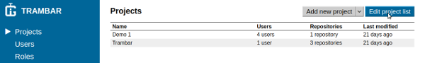

3. The list will expand to show all projects, including those archived or deleted earlier. Click the name of each project that you wish to archive.

   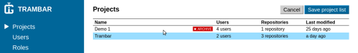

4. Click the **Save project list** button.   

   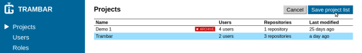

### Deleting a project

Deleting a project destroys its records permanently. Typically, you would only do this after making a mistake shortly after the project's creation.

1. Click **Projects** in the left navigation pane.

   

2. Click the name of the project you wish to delete.

   

3. Click the arrow beside the gray button, then **Delete project**.

   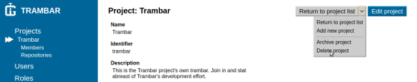

If you've deleted a project by mistake, use the browser's back button to return to the page and click the **Restore project** button.

### Restoring archived or deleted projects

You can easily put a project back into an active state. Deleted projects can also be restored, provided its records have not yet been garbage-collected.

1. Click **Projects** in the left navigation pane.

   

2. Click the **Edit project list** button.

   

3. The list will expand to show all projects, including those archived or deleted earlier. Click the name of each project that you wish to restore.

   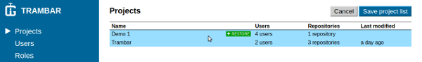

4. Click the **Save project list** button.   

   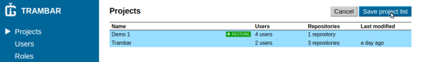

## Members

* [Approving membership requests](#approving-membership-requests)
* [Rejecting membership requests](#rejecting-membership-requests)
* [Adding existing users as members](#adding-existing-users-as-members)
* [Adding a new member manually](#adding-a-new-member-manually)
* [Removing members](#removing-members)

### Approving membership requests

1. Click **Projects** in the left navigation pane.

   

2. Click the name of the project.

   

3. Click **Members** in the left navigation pane.

   

4. If there are unapproved requests, certain users will appear grayed out in the list. Click the **Approve all requests** button to bring these pending members into the project.

   

If you wish to add only some of the users, follow the [instructions for adding users](#adding-existing-users-as-members) instead.

### Rejecting membership requests

1. Click **Projects** in the left navigation pane.

   

2. Click the name of the project.

   

3. Click **Members** in the left navigation pane.

   

4. If there are unapproved requests, certain users will appear grayed out in the list. Click the arrow beside the **Approve all requests** button, then click **Reject all requests**.

   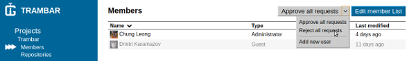

### Adding existing users as members

1. Click **Projects** in the left navigation pane.

   

2. Click the name of the project.

   

3. Click **Members** in the left navigation pane.

   

4. Click the **Edit member list** button.

   

5. The list will expand to show all users. Click the name of each user that you wish to add.

   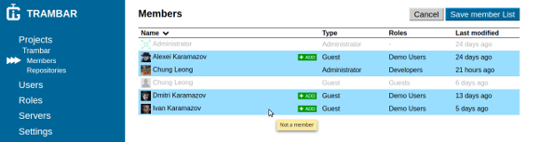

6. Click the **Save member list** button.   

   

### Adding a new member manually

In order to add a user, you must know the e-mail address he had used to register at an OAuth provider.

1. Click **Projects** in the left navigation pane.

   

2. Click the name of the project.

   

3. Click **Members** in the left navigation pane.

   

4. Click the arrow beside the gray button, then **Add new user**.

   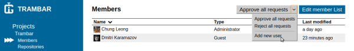

5. Enter the new member's personal information. Select a profile image. Choose the user type and role.

   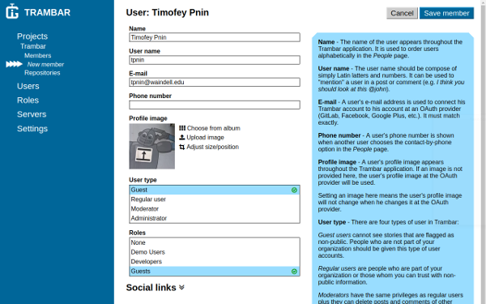

6. Click the **Save member** button.

   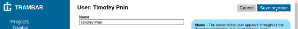

### Removing members

1. Click **Projects** in the left navigation pane.

   

2. Click the name of the project.

   

3. Click **Members** in the left navigation pane.

   

4. Click the **Edit member list** button.

   

5. The list will expand to show all users. Current members will be highlighted. Click the name of each member that you wish to remove.

   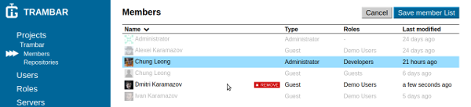

6. Click the **Save member list** button.   

   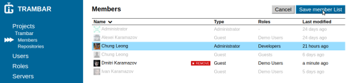

## Repositories

* [Adding repositories to a project](#adding-repositories-to-a-project)
* [Removing repositories](#removing-repositories)

### Adding repositories to a project

1. Click **Projects** in the left navigation pane.

   

2. Click the name of the project.

   

3. Click **Repositories** in the left navigation pane.

   

4. Click the **Edit repository list** button.

   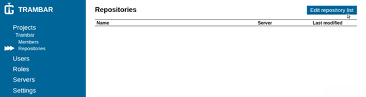

5. The list will expand to show all repositories. Click the name of each repo you wish to associate with the project.

   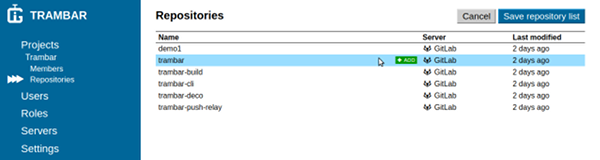

6. Click the **Save repository list** button.   

   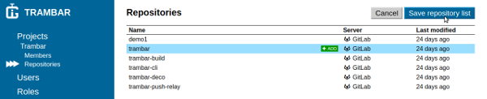

### Removing repositories

Removing a repo from a project does not remove stories from that repo. If you've accidentally added the wrong repo, your project is fubar. A mean to rectify such a situation will be implemented in the future.

1. Click **Projects** in the left navigation pane.

   

2. Click the name of the project.

   

3. Click **Repositories** in the left navigation pane.

   

4. Click the **Edit repository list** button.

   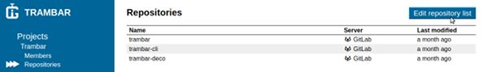

5. The list will expand to show all repositories. Click the name of each repo you wish to remove.

   

6. Click the **Save repository list** button.   

   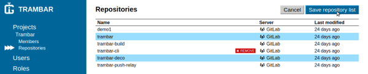

## Users

* [Adding a new user manually](#adding-a-new-user-manually)
* [Deactivating users](#deactivating-users)
* [Deleting a user](#deleting-a-user)
* [Restoring deactivated or deleted users](#restoring-deactivated-or-deleted-users)

### Adding a new user manually

In order to add a user, you must know the e-mail address he had used to register at an OAuth provider.

1. Click **Users** in the left navigation pane.

   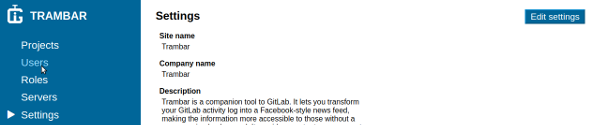

2. Click the **Add new user** button.   

   

3. Enter the new user's personal information. Select a profile image. Choose the user type and role.

   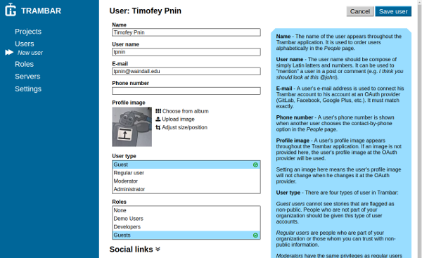

4. Click the **Save user** button.

   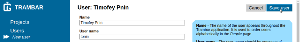

### Deactivating users

Deactivating a user keeps him from signing into Trambar again. Posts and comments he has written will remain.

1. Click **Users** in the left navigation pane.

   

2. Click the **Edit user list** button.

   

3. The list will expand to show all users, including those deactivated or deleted earlier. Click the name of each user you wish to deactivate.

   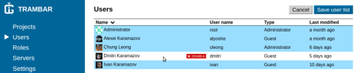

4. Click the **Save user list** button.

   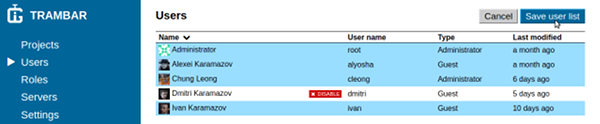

### Deleting a user

Deleting a user removes him from the system completely. Posts and comments written by him will be deleted as well.

1. Click **Users** in the left navigation pane.

   

2. Click the name of the user you wish to delete.

   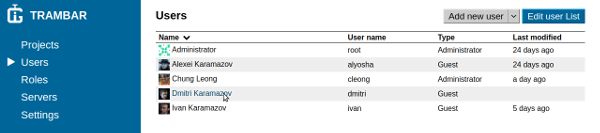

3. Click the arrow beside the gray button, then **Delete user account**.

   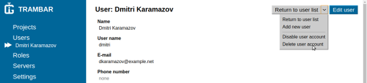

If you've deleted a user by mistake, use the browser's back button to return to the page and click the **Restore user** button.

### Restoring deactivated or deleted users

Deactivated user accounts can be made active again. Deleted users can also be restored, provided his records have not been garbage-collected yet.

1. Click **Users** in the left navigation pane.

   

2. Click the **Edit user list** button.

   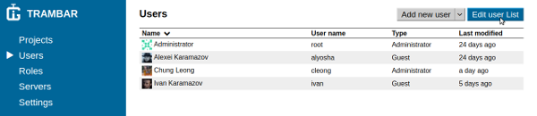

3. The list will expand to show all users, including those who were deactivated or deleted earlier. Click the name of each user you wish to restore.

   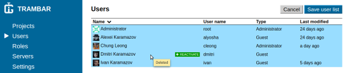

4. Click the **Save user list** button.

   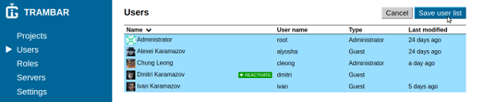

## Roles

* [Adding a new role](#adding-a-new-role)
* [Assigning a role to users](#assigning-a-role-to-users)
* [Assigning a role automatically to new users](#assigning-a-role-automatically-to-new-users)
* [Removing users from a role](#removing-users-from-a-role)
* [Deactivating roles](#deactivating-roles)
* [Deleting a role](#deleting-a-role)
* [Restoring deactivated or deleted roles](#restoring-deactivated-or-deleted-roles)

### Adding a new role

1. Click **Roles** in the left navigation pane.

   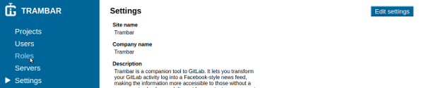

2. Click the **Add new role** button.   

   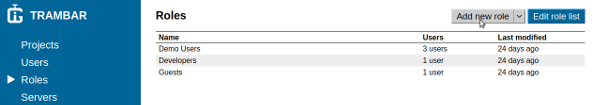

3. Enter the name and description of the role.

   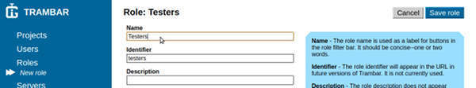

4. Select a story priority.

   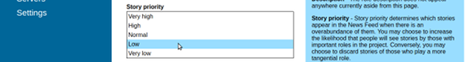

   Story priority comes into play when a user has many (100+) unread stories and Trambar must decide which to present and which to omit. Typically, you would want to suppress posts by those whose role in the project is somewhat tangential.

5. Choose the users to whom you wish to assign the new role.

   

6. Click the **Save role** button.

   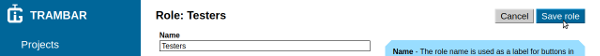

### Assigning a role to users

1. Click **Roles** in the left navigation pane.

   

2. Click the name of the role you wish to assign.

   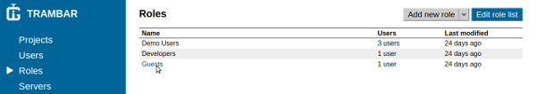

3. Click the **Edit role** button.

   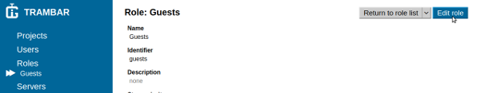

4. Under **Users**, click the name of each user to whom you wish to assign the role.

   

5. Click the **Save role** button.

   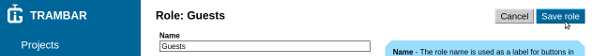

### Assigning a role automatically to new users   

1. Click **Servers** in the left navigation pane.

   

2. Click the name of the server whose users should be assigned the role.

   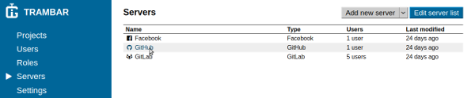

3. Click the **Edit server** button.

   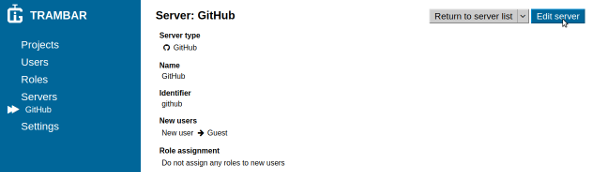

4. Under **Role assignments**, click the role that will be assigned to new users from the server.

   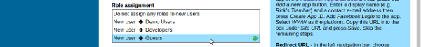

5. Click the **Save server** button.

   

### Removing users from a role

1. Click **Roles** in the left navigation pane.

   

2. Click the name of the role from which you wish to remove users.

   

3. Click the **Edit role** button.

   

4. Under **Users**, click the name of each user you wish to remove from the role.

   

5. Click the **Save role** button.

   

### Deactivating roles

1. Click **Roles** in the left navigation pane.

   

2. Click the **Edit role list** button.

   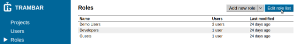

3. The list will expand to show all roles, including those disabled or deleted earlier. Click the name of each role you wish to disable.

   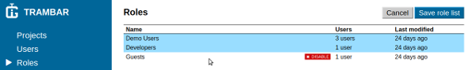

4. Click the **Save role list** button.

   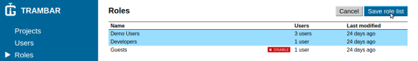

### Deleting a role

1. Click **Roles** in the left navigation pane.

   

2. Click the name of the role you wish to delete.

   

3. Click the arrow beside the gray button, then **Delete role**.

   

If you've deleted a role by mistake, use the browser's back button to return to the page and click the **Restore role** button.

### Restoring deactivated or deleted roles

1. Click **Roles** in the left navigation pane.

   

2. Click the **Edit role list** button.

   

3. The list will expand to show all roles, including those who were deactivate or deleted earlier. Click the name of each role you wish to restore.

   

4. Click the **Save role list** button.

   

## Servers

* [Adding a GitLab server](#adding-a-gitlab-server)
* [Adding Dropbox](#adding-dropbox)
* [Adding Facebook](#adding-facebook)
* [Adding GitHub](#adding-github)
* [Adding Google+](#adding-google)
* [Adding Windows Live](#adding-windows-live)
* [Deactivating servers](#deactivating-servers)
* [Deleting a server](#deleting-a-server)
* [Restoring deactivated or deleted servers](#restoring-deactivated-or-deleted-servers)

### Adding a GitLab server

1. Click **Servers** in the left navigation pane.

   

2. Click the **Add new server** button.

   

3. Under **Server type**, select *GitLab*.

   

4. In a different browser window, sign into GitLab using an account with administrative privilege.

5. Navigate to the **Admin area**.

   

6. Click **Applications** in the left navigation pane.

   

7. Click the **New application** button.

   

8. Enter *Trambar* as the application's name, then copy the **Redirect URI** from Trambar Administrative Console into the corresponding box here. Select **api** and **read_user** as the application's scope, the click the **Submit** button.

   

   

9. Copy the **Application id** and **Application secret** from GitLab into the corresponding box in Trambar Administrative Console.

   

   

10. Copy the URL of the GitLab server into the corresponding box in Trambar Adminstrative Console.

    

    The URL should contains only the domain name (and possibly a port number).

11. Indicate how you wish to map users from GitLab to Trambar.

    

    A typical setup is to map GitLab administrator to Trambar administrator, GitLab regular user to Trambar regular user, and GitLab external user to Trambar guest. Users can be promoted to more privileged user type on a case by case basis.

12. Click the **Save server** button.

    

13. Click the **Acquire API access** button.

    

14. A GitLab pop-up window will appear. Click the **Authorize** button, then close the window when it says *OK*.

    

If you're using a local instance of GitLab 11, be sure the server permits outbound requests to the local network. Otherwise Trambar will not be able to install project hooks (for monitoring events). You'll find the checkbox in **Admin Area** > **Settings** > **Outbound requests**.

### Adding Dropbox

1. Click **Servers** in the left navigation pane.

   

2. Click the **Add new server** button.

   

3. Under **Server type**, select *Dropbox*.

   

4. In a different browser window, sign into [Dropbox App Console](https://www.dropbox.com/developers/apps).

5. Click the **Create app** button.

   

6. Select **Dropbox API**.

   

7. Select **App Folder** as the access level.

   

   Trambar won't actually write anything to the folder. OAuth is used for authentication only.

8. Enter an application name. The name should contain the name of your company so that users will be able to correctly identify your app in Dropbox.

   

9. Click the **Create app** button.

   

10. Copy and paste the **Redirect URI** then click the **Add** button.

   

   

11. Copy and paste the **App key** and **App secret** into Trambar
    Administrative Console.

    

    

12. Under **New users** select a user type for users coming from GitHub.

    

13. Optionally, choose a role for new users under **Role assignment**.

    

14. Click the **Save server** button.

    

15. Click the **Test OAuth integration** button. A Dropbox pop-up window will appear. Grant authorization when prompted. Afterward, the page should simply read "OK".

   

16. Return to the Dropbox App Console. Click the **Apply for production** button to make the app publicly available.

   

### Adding Facebook

1. Click **Servers** in the left navigation pane.

   

2. Click the **Add new server** button.

   

3. Under **Server type**, select *Facebook*.

   

4. In a different browser window, sign into [Facebook App Dashboard](https://developers.facebook.com/apps/).

5. Click the **Add a New App** button.

   

6. Enter a display name and a contact e-mail address. The display name should contain the name of your company so that users will be able to correctly identify your app.

   

7. Click the **Create App ID** button

   

8. In the box label **Facebook Login**, click the **Set up** button.

   

9. Select **WWW** as the platform.

   

10. Copy and paste the **Site URL**.

   

   

11. Click the **Save button**.

    

12. Click **Settings** under **Facebook Login** in the left navigation pane.

    

13. Copy and paste the **Redirect URI**.

    

    

14. Copy and paste the **Deauthorize Callback URL**.

    

    

15. Click the **Save Changes** button at the bottom of the page.

    

16. Click **Basic** under **Settings** in the left navigation pane.

    

17. Copy and paste the URLs for **Privacy policy** and **Terms** (or supply your own).

    

    

18. Download the default icon from Trambar Adminstrative Console.

    

    Click **App icon** and upload the image file.

    

19. Choose *Utility & Productivity* as the app category.

    

20. Click the **Save Changes** button at the bottom of the page.

    

21. Copy and paste **App ID** into Trambar Administrative Console.

    

    

22. Click the **Show** button in the **App Secret** text box. Copy and paste the secret token into Trambar Administrative Console.

    

    

23. Under **New users** select a user type for users coming from Facebook.

    

24. Optionally, choose a role for new users under **Role assignment**.

    

25. Click the **Save server** button.

    

26. Click the **Test OAuth integration** button. A Facebook pop-up window will appear. Grant authorization when prompted. Afterward, the page should simply read "OK".

    

27. Return to the Facebook App Dashboard. Click the **OFF** switch and confirm that you wish to make the app public.

    

### Adding GitHub

1. Click **Servers** in the left navigation pane.

   

2. Click the **Add new server** button.

   

3. Under **Server type**, select *GitHub*.

   

4. In a different browser window, navigate to the [GitHub Developer Settings](https://github.com/settings/developers) page.

5. Click the **New OAuth App** button.

   

6. Enter an application name. The name should contain the name of your company so that users will be able to correctly identify your app in GitHub.

   

7. Copy the **Site URL** from Trambar Administrative Console and use it as the app's **Homepage URL**.

   

   

8. Copy and paste the **Callback URL**.

   

   

9. Click the **Register Application** button.

   

10. Download the default app icon from Trambar Administrative Console.

   

   Click the **Upload new logo** under **Application logo** and upload the image file.

   

11. Set the **Badge color** to `#f29d25`.

   

12. Click the **Update application** button.

   

13. Copy and paste the **Client ID** and **Client secret** into Trambar Administrative Console.

    

    

14. Under **New users** select a user type for users coming from GitHub.

    

15. Optionally, choose a role for new users under **Role assignment**.

    

16. Click the **Save server** button.

    

17. Click the **Test OAuth integration** button. A GitHub pop-up window will appear. Grant authorization when prompted. Afterward, the page should simply read "OK".

    

### Adding Google+

1. Click **Servers** in the left navigation pane.

   

2. Click the **Add new server** button.

   

3. Under **Server type**, select *Google*.

   

4. In a different browser window, sign into [Google Developer Console](https://console.developers.google.com/cloud-resource-manager).

5. Click the **Create Project** button.

   

6. Enter a **Project name**.

   

7. Click the **Create** button.

         

8. Switch to the newly created project if it's not currently selected using the drop-down list at the top of the page.

   

9. Click the **Enable APIs and Services** button.

   

10. Look for "Google+" and click the button.

   

11. Click the **Enable** button.

   

12. Click the "hamburger" button.

   

13. Under **APIs & Services**, click **Credentials**.

    

14. Click the **Create credentials** button, then **OAuth client ID**.

    

15. Click the **Configure consent screen** button.

    

16. Enter an product name. The name should contain the name of your company so that users will be able to correctly identify your app in Google.

17. Copy the **Site URL** from Trambar Administrative Console and use it as the
    **Homepage URL**.

    

    

18. Copy the address of one of the default app icons and paste it into the box labeled **Product logo URL**.

    

    

19. Copy and paste the **Privacy policy** and **Terms**.

    

    

20. Click the **Save** button.

    

21. Select *Web application* as the **Application Type**.

    

22. Copy and paste the **Redirect URI**.

    

    

23. Click the **Create** button.

    

24. Copy and paste the **client ID** and **Client secret** into Trambar Administrative Console.

    

    

25. Under **New users** select a user type for users coming from Google.

    

26. Optionally, choose a role for new users under **Role assignment**.

    

27. Click the **Save server** button.

    

28. Click the **Test OAuth integration** button. A Google pop-up window will appear. Grant authorization when prompted. Afterward, the page should simply read "OK".

    

### Adding Windows Live

1. Click **Servers** in the left navigation pane.

   

2. Click the **Add new server** button.

   

3. Under **Server type**, select *Windows Live*.

   

4. In a different browser window, sign into to [Windows Live Application Management](https://apps.dev.microsoft.com/).

5. In the **Live SDK Application** section, click **Add an app**.

   

6. Enter an application name. The name should contain the name of your company so that users will be able to correctly identify your app in Windows.

   

7. Click the **Create application** button.

   

8. In the **Platforms** > **Web** section, click the **Add URL** button. Copy and paste the **Redirect URL** from Trambar Administrative Console.

   

   

9. Download the default app icon from Trambar Administrative Console.

   

   Click the **Add** button under **Profile** > **Logo** and upload the image file.

   

10. Copy and paste the URL for **Privacy policy** and **Terms**.

   

   

11. Click the **Save** button at the bottom of the page.

12. Copy and paste the **Application ID** and **Application secret** into Trambar Administrative Console.

    

    

13. Under **New users** select a user type for users coming from Windows Live.

    

14. Optionally, choose a role for new users under **Role assignment**.

    

15. Click the **Save server** button.

    

16. Click the **Test OAuth integration** button. A Windows pop-up window will appear. Grant authorization when prompted. Afterward, the page should simply read "OK".

    

### Deactivating servers

1. Click **Servers** in the left navigation pane.

   

2. Click the **Edit server list** button.

   

3. The list will expand to show all servers, including those disabled or deleted earlier. Click the name of each server you wish to disable.

   

4. Click the **Save server list** button.

   

### Deleting a server

1. Click **Servers** in the left navigation pane.

   

2. Click the name of the server you wish to delete.

   

3. Click the arrow beside the gray button, then **Delete server**.

   

If you've deleted a server by mistake, use the browser's back button to return to the page and click the **Restore server** button.

### Restoring deactivated or deleted servers

1. Click **Servers** in the left navigation pane.

   

2. Click the **Edit server list** button.

   

3. The list will expand to show all servers, including those who were deactivated or deleted earlier. Click the name of each server you wish to restore.

   

4. Click the **Save server list** button.

   

## Settings

* [Changing background image](#changing-background-image)
* [Changing site description](#changing-site-description)
* [Providing site descriptions in anther language](#providing-site-description-in-anther-language)

### Changing background image

1. Open a new browser window and sign into the web client. This will allow you see to changes as soon as you save them.

2. Click **Settings** in the left navigation pane.

   

3. Click the **Edit settings** button.

   

4. Under **Background image**, click either **Upload image** or **Choose from album** and select an image.

   

5. Click the **Save settings** button.

   

6. Check the appearance of the web client in the other browser window. If you're not satisfied, click the **Edit settings** button again.

### Changing site description

1. Open a new browser window and sign into the web client. This will allow you see to changes as soon as you save them.

2. Click **Settings** in the left navigation pane.

   

3. Click the **Edit settings** button.

   

4. Edit the text in the text box under **Description**. If you're text text from elsewhere, be sure there aren't any stray newlines.

   

5. Click the **Save settings** button.

   

6. Check the appearance of the web client in the other browser window. If you're not satisfied, click the **Edit settings** button again.

### Providing site description in anther language

1. Click **Settings** in the left navigation pane.

   

2. Click the **Edit settings** button.

   

3. Under **Languages**, click the language you wish to add.

   

4. Language tabs will appear beneath text boxes that accept text in multiple languages. Under **Description**, click the language that you added.

   

5. Type or paste in the description in the chosen language.

   

   Place the mouse cursor over the primary language to see the description in that language:

   

6. Provide a site name in the new language if it's different.

7. Click the **Save settings** button.

   

You will now be able to enter project descriptions in the new language as well.
