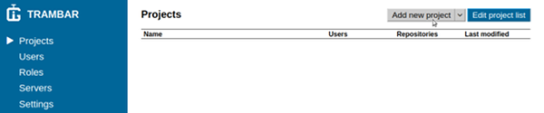
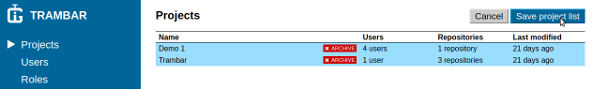
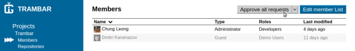
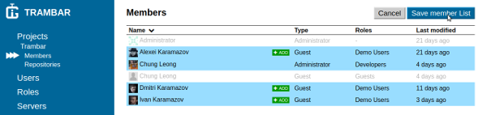
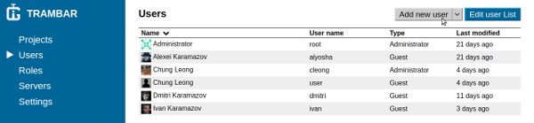
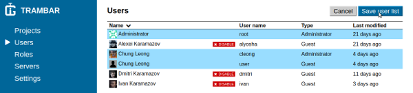

Trambar User Guide - Administrative Console
-------------------------------------------

* [Sign in](#sign-in)
* [Projects](#projects)
* [Members](#members)
* [Repositories](#repositories)
* [Users](#users)
* [Roles](#roles)
* [Servers](#servers)
* [Settings](#settings)

## Projects

* [Adding a new project](#adding-a-new-project)
* [Archiving old projects](#archiving-old-projects)
* [Deleting a project](#deleting-a-project)
* [Restoring a project](#restoring-a-project)

### Adding a new project

### Archiving old projects

### Deleting a project

### Restoring a project

## Members

* [Approving membership requests](#approving-membership-requests)
* [Rejecting membership requests](#rejecting-membership-requests)
* [Adding existing users](#adding-existing-users)
* [Adding a new member](#adding-a-new-member)
* [Deleting members](#deleting-members)

### Approving membership requests

### Rejecting membership requests

### Adding existing users

### Adding a new member

### Deleting members

## Repositories

* [Adding repositories to project](adding-repositories)
* [Removing repositories](removing-repositories)

### Adding repositories to project

### Removing repositories

## Users

* [Adding a new user](#adding-a-new-user)
* [Deactivating users](#deactivating-a-users)
* [Deleting a user](#deleting-a-user)
* [Restoring users](#restoring-users)

### Adding a new user

### Deactivating users

### Deleting a user

### Restoring users

## Roles

* [Adding a new role](#adding-a-new-role)
* [Disabling roles](#disabling-roles)
* [Deleting a role](#deleting-a-role)
* [Assigning users to a role](#assigning-users-to-a-role)

### Adding a new role

### Disabling roles

### Deleting a role

### Assigning users to a role

## Servers

* [Adding a GitLab server](#adding-a-gitlab-server)
* [Adding Dropbox](#adding-dropbox)
* [Adding Facebook](#adding-facebook)
* [Adding GitHub](#adding-github)
* [Adding Google+](#adding-google)
* [Adding Windows Live](#adding-windows-live)

### Adding a GitLab server

### Adding Dropbox

### Adding Facebook

### Adding GitHub

### Adding Google+

### Adding Windows Live

### Disabling server

## Settings
