Trambar User Guide
------------------

* [Start - web browser](#start---web-browser)
* [Start - mobile app](#start---mobile-app)
* [News](#news)
* [Notifications](#notifications)
* [Bookmarks](#bookmarks)
* [People](#people)
* [Settings](#settings)
* [Calendar](#calendar)
* [Filters](#filters)
* [Search](#search)

## Start - web browser

The **Start** page is the first page that you'll see when you visit a Trambar
website.


On the left is a description of the site. On the right is a list of OAuth
authentication provider. GitLab will likely be among the choices. If you have an
account on the server, that's the button you should click. If not, then you will
need to use one of the other options.

A pop-up window will appear. If you're not signed already, you'll be prompted
to do so. Once that's done, you might be greeted by a screen asking you to
authorize the app:


Or the pop-up window might just quickly closes if authorization was granted
earlier.

It's possible to associate your Trambar account with multiple social-network
accounts as long as the same e-mail address was used to create those accounts.
You might do this if your GitLab server is protected by a firewall and you
happen to be outside the permitted IP range. (You shouldn't try this with
Facebook, since most likely your privacy settings preclude the sharing of your
e-mail address).

Social networks are used for authentication purpose only. Trambar will not
retrieve your friend list or post things to your wall.

Once you have signed in, you will see a list of projects:

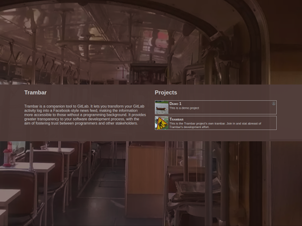

Click a project button to see the full description. If you're not a member of
the project, you might have the option to request membership. You might be able
to browse the project without gaining membership first, depending on how the
project was set up by the administrator.

### Start - mobile app

In the mobile app, the **Start** page will appear if you have not yet connected
the app to a server:

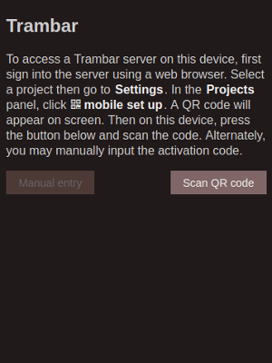

To make that connection, first sign into the server using a web browser. Select a
project then go to **Settings**. In the Projects panel, click **mobile set up**.
A QR code will appear on-screen:


On the mobile device, click the **Scan QR code** button and scan in the code.
A green message will appear near the bottom of the screen when the code is
correctly captured. A welcome message should quickly follow.

## News

In the **News** page, you'll find the currently selected project's news feed. Up
to 100 stories are shown.

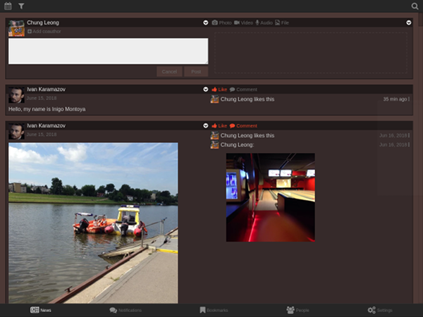

* [Story selection](#story-selection)
* [Story editor](#story-editor)
* [Story view](#story-view)
* [Story options](#story-options)
* [Story types](#story-types)
* [Reaction types](#reaction-types)

### Story selection

The news feed is individualized. If you visit the site frequently, you'll end up
seeing every story. If you visit the site only on occasions and the number of
unread stories exceeds 100, you would only see the top 100. Stories are ranked
using a set of heuristic rules:

* Certain types of stories (merge, wiki, issue, survey) have high base scores
* Stories receive points for each like and comment
* Recent stories are given an extra boost
* A "diversity bonus" is given to stories by users who write infrequently
* Stories by users with a certain role can have a higher score

Suppose you on a team developing a software for an external client. You've
invited the client representative to your trambar so she can see the project is
moving forward. At the end of each week, she fires up Trambar on her phone and
spends a few minutes flipping through the feed. She'll see what're basically
the week's highlights. The lead programmer, on the other hand, keeps Trambar
open in a second monitor. When something occurs, he sees it immediately. The
scoring system describe above does not come into play at all.

In this scenario, the client representative would have a guest account. She
would not see stories meant only for internal use. The lead programmer would
likely have a moderator account, with the power to hide other users' stories
from guests. He might choose to suppress a post that triggered a long discussion
over coding techniques, for instance.

### Story editor

Project members are allowed to post stories. The story editor sits at the top of
the News page. If you have scrolled down, you can return to the top by clicking
the **News** button.

* [Editor Interface](#editor-interface)
* [Auto saving](#auto-saving)
* [Markdown](#markdown)
* [Task list and survey](#task-list-and-survey)
* [Tagging](#tagging)
* [Emojis](#emojis)
* [Attachments](#attachments)
* [Embedded media](#embedded-media)
* [Coauthors](#coauthors)

#### Editor interface

The story editor adjust its UI to fit the space available. On a wide screen,
its three parts appear side-by-side:

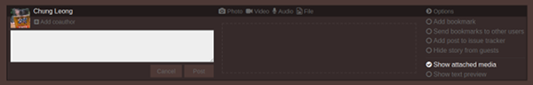

On the left is the text editor. In the center is the text-preview/media pane.
On the right are [story options](#story-options) that you can toggle.

When the screen is a bit more narrow, the stories options are relocated to
pop-up menus:

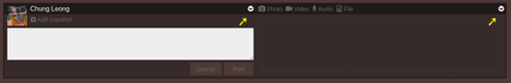

On a mobile device (or if you've resized a browser window to a narrow strip),
the two remaining panels are stacked on top of each other:

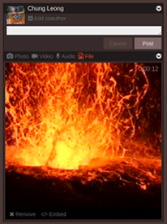

#### Auto-saving

Contents entered into the story editor are automatically saved to the remote
server. This allows you to start a post on a mobile phone (making use of
not-so-perfect voice recognition, perhaps) and finish editing it on a computer
once you've returned to your desk.

#### Markdown

The text editor accepts either plain text or [Markdown](https://guides.github.com/features/mastering-markdown/).
When you employ Markdown formatting, Trambar will automatically switch to
Markdown mode and activate the text preview pane:

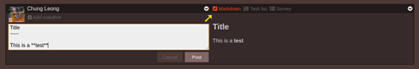

#### Task list and survey

The editor also permits the creation of task lists and surveys:

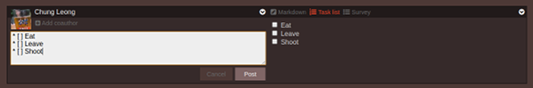

When Trambar sees a list, it assumes you want to create a task list. If you
want to create a survey instead, you would need to click the **Survey** button:

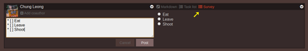

The sequence `*[]` is automatically expanded to `* [ ]`. This makes list
creation on a touch device much easier.

#### Tagging

Hash tags can be added to a story to make it easily to find in a search.
Trambar also supports @tags, used to indicate that someone is mentioned in a
post. You can find a user's username in the [People](#people) page.

#### Emojis

Trambar supports the displaying of emojis on desktop web-browsers. Currently
there's no mechanism for inputing them, however.

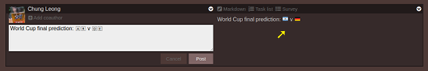

#### Attachments

You can attach images, video clips, and audio clips to your posts. These can be
pre-recorded or captured live from your phone or computer's camera.

* [Capturing an image](#capturing-an-image)
* [Capturing a video or audio](#capturing-a-video-audio)
* [Adding screenshots](#adding-screenshots)

##### Capturing an image

Click the **Photo** button in the media pane to activate the camera:


Doing so the first time, you'll be ask to grant permission to use the device.
The Trambar mobile app utilizes your phone's camera app to take the picture.
That gives you much more control compared with the web client.

##### Capturing a video or audio

Click either the **Video** or **Audio** button. Again, you'll be ask to grant
permission to use the device.

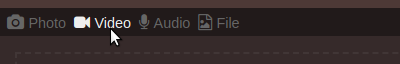

With the mobile app, video clips are limited to 5 minutes, while audio clips are
limited to 15 minutes. If you wish to make longer recordings, you should
activate the video/audio recorder by clicking the **File** button instead.

With the web client, video and audio are streamed to the server. They can be as
long as you like. Hour-long videos have been made in tests without difficulties.
Such videos take up considerable space, however--up to a gigabyte each. If you
plan to making long recordings regularly (recording all your meetings, for
instance), you would need to give your server a generous amount of storage.

Video and audio recording are not available in Edge and Safari.

##### Adding screenshots

On Windows, you can capture the contents of the current window by pressing
Alt-PrtSrn. The image will be placed in the clipboard. You can then paste it
into the text editor. On Linux the procedure is similar.

On OSX, pressing Shift-Cmd-4 will cause the mouse pointer become a
cross-hair. You can then select a region of the screen you wish to capture. Or
you can press Space at this point, changing the mouse pointer to a camera. You
can then capture the contents of a window. Afterward, click the **File** button
then select the image file sitting on your desktop.

#### Embedded media

Media attached to a story can be embedded into Markdown text. The tag
`![image-1]` or `![picture-1]` refers to the first image attached. `![video-2]`
meanwhile refers to the second video attached. A tiny thumbnail appears in
place of the tag:

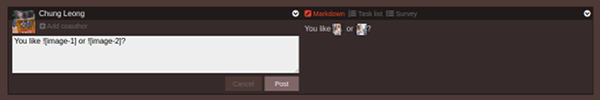

When the thumbnail is clicked, a pop-up windows appears showing the full image
(or video). Audio can also be embedded.

Task lists and surveys can use Markdown so media can be embedded into them as
well. Suppose you want your team to choose between four images. You would type
in the following:

```
Which picture do you like best:

* [ ] ![image-1]
* [ ] ![image-2]
* [ ] ![image-3]
* [ ] ![image-4]
```

The result would look like this:

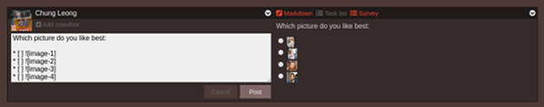

#### Coauthors

Trambar allows multiple people to edit the same story at the same time. The
feature is most useful when two or more people are working on a [list of tasks](#task-list).
They can come up with the list together. Afterward, each of them can check off
tasks as they're completed.

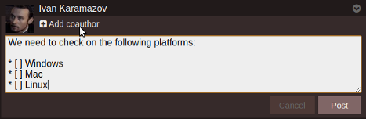

When a user is designated as a coauthor, he'll receive a notification.

### Story view

The story view adjust its UI to fit the space available. On a wide screen,
its three parts appear side-by-side:

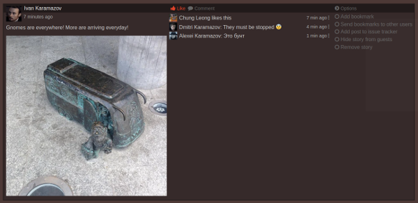

On the left are the story contents. In the center are reactions to the story.
On the right are [story options](#story-options) that you can toggle.

When the screen is a bit more narrow, the stories options are relocated to a
pop-up menu:

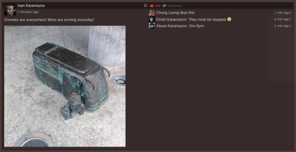

On a mobile device (or a narrow browser window), the two remaining panels are
stacked on top of each other:

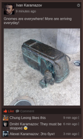

In this view, reactions are initially hidden unless you're the story's author
or you've reacted to the story.

### Story options

* [Bookmark story](#bookmark-story)
* [Send bookmark to others](#send-bookmark-to-others)
* [Add issue to tracker](#add-issue-to-tracker)
* [Hide from guests](#hide-from-guests)
* [Bump story](#bump-story)
* [Remove story](#remove-story)

#### Bookmark story

Bookmarking a story allows you to find it more easily later. Bookmarked stories
will appear in the [Bookmarks](#bookmarks) page.

#### Send bookmark to others

Sending bookmarks to other users draws their attention to the story.

#### Add issue to tracker

If your account is connected to GitLab, you can take a post and add it as an
issue in GitLab's issue tracker:


The post could be written by another user. For instance, one day your client
notices something funny in the app you're developing. He records the behavior
using his phone and posts it onto the project's trambar. After reviewing the
video, you decide that it is a bug. So you open an issue and tag it as such.

#### Hide from guests

If you do not want a story seen by guest users, use this option.

#### Bump story

Bumping a story makes it appear at the top again.

#### Remove story

Removing a story means it'll disappear for all users. Regular users and guests
can only remove their own stories. Administrator and moderator can remove other
people's stories.

### Story types

* [Post](#post)
* [Task list](#task-list)
* [Survey](#survey)
* Git events
  * [Push](#push)
  * [Merge](#merge)
  * [Branch](#branch)
  * [Issue](#issue)
  * [Merge request](#merge-request)
  * [Milestone](#milestone)
  * [Membership](#membership)
  * [Repository](#repository)
  * [Wiki](#wiki)

#### Post

A **Post** is a message you wish to share with others. It might contain ideas or
observations about the project. It might be a question. It might be a video
depicting an software defect--or your cat doing something funny.

#### Task list

**Task list** is self-reporting mechanism letting others know what you're
working on. It's not designed for workflow purpose. You cannot assigned a task
list to someone else. You can, however, designate other users as coauthors of
the list, allowing them to mark off tasks as completed.

#### Survey

A **Survey** lets you solicit opinion from other project members. It might be a
question concerning how a feature should work. It might be a question on where
to get lunch.

##### Push

A **Push** story is posted whenever someone pushes code into a git
repository associated with the project. If [Trambar decoration](decoration.md)
is present in the source tree, you'll see which parts of the application are
impacted by the code changes.

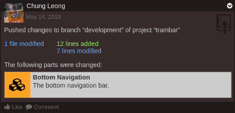

If you have GitLab access, clicking on the text will send you to a page showing
the diff.

##### Merge

A **Merge** story is posted whenever someone merges code from one branch
into another. It's basically a special kind of push. You may choose to receive
notification when a merge to master occurs.

##### Branch

A **Branch** story is another special kind of push. It occurs when someone
pushes a new branch into a git repository. In a typical workflow, that usually
means he's begun implementing a new feature or fixing a bug requiring
substantial changes.

##### Issue

An **Issue** story is posted whenever someone opens a new issue in GitLab's
issue tracker.

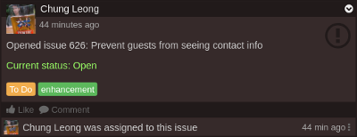

The issue's status as well as its labels will get updated as they change
subsequently. When the issue is closed, the story will get bumped to the top
of the news feed.

If you have GitLab access, clicking on the text will send you to the issue page.

You may choose to receive notification when someone is assigned to your issues.

##### Merge request

A **Merge request** story is posted whenever someone creates a merge request.

##### Milestone

A **Milestone** story is posted whenever someone creates a milestone.

##### Membership

A **Membership** story indicates someone has either joined or left a GitLab
project (i.e. gained or lost access to a repository).

##### Repository

A **Repository** story is posted when a git repository is created or deleted.
Typically, you would only see it at the very beginning of a project's history.

##### Wiki

A **Wiki** story is posted when someone makes changes to a wiki page. Only one
story will get generated when multiple saves occur within a 24-hour period.

If you have GitLab access, clicking on the text will send you to the wiki page.

### Reaction types

* [Like](#like)
* [Comment](#comment)
* [Vote](#vote)
* [Task completion](#task-completion)
* Git reactions
  * [Note](#note)
  * [Issue assignment](#issue-assignment)
  * [Issue tracking](#issue-tracking)

#### Like

A **Like** indicates that someone likes a story.

#### Comment

A **Comment** is a message posted in response to a story--or perhaps an earlier
comment.

#### Vote

A **Vote** reaction indicates that someone has answered a [survey](#survey).

#### Task completion

A **Task completion** reaction indicates that someone has completed a task on a
[task list](#task-list). Only the author(s) of a task list can trigger it.

##### Note

A **Note** reaction indicates that someone has written a comment in GitLab
concerning an issue, a merge request, or a commit.

##### Issue assignment

An **Issue assignment** reaction indicates that someone has been assigned to
an [issue](#issue-assignment) in the GitLab issue tracker.

##### Issue tracking

An **Issue tracking** reaction indicates that someone, most likely a programmer,
has [placed a post](#add-issue-to-tracker) into GitLab's issue tracker.

## Notifications

In the **Notifications** page, you'll find your notification messages, informing
you how others people have reacted to your stories:

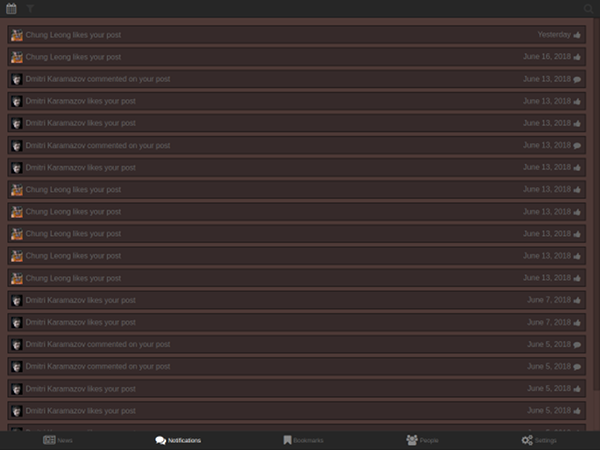

By default, you're immediately alerted upon receiving most notifications. You
can adjust this behavior in the [Settings](#notification) to reduce the amount of
distraction.

Unread notifications will be marked as read after a few seconds.

## Bookmarks

In the **Bookmarks** page, you'll see stories you have bookmarked, as well as
stories other project members want you to pay attention to:

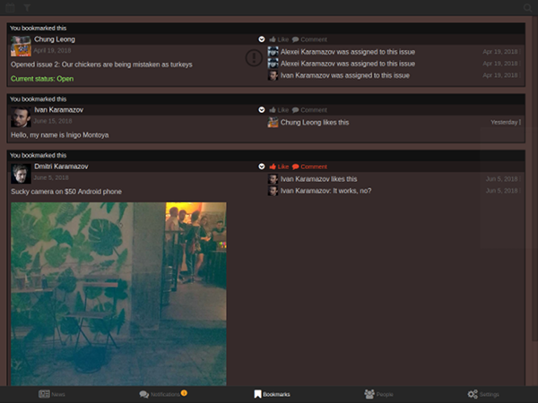

To remove a bookmarked story, simply uncheck the **Keep bookmark** option.

## People

In the **People** page, you'll see the activities of all project members:

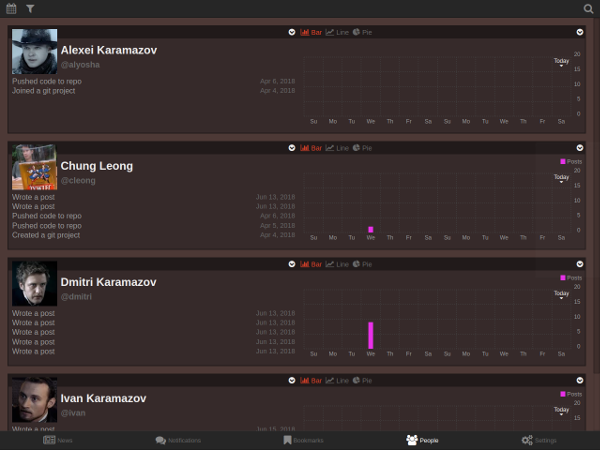

* [User view](#user-view)
* [Recent activities](#recent-activities)
* [Activity chart](#activity-chart)
* [Actions](#actions)

### User view

The user view adjust its UI to fit the space available. On a wide screen,
its three parts appear side-by-side:

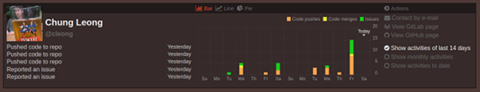

On the left are a user's recent activities. In the center are user statistics.
On the right are user actions.

When the screen is a bit more narrow, user actions are relocated to pop-up
menus:

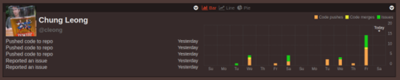

On a mobile device (or in a narrow browser window), the two remaining panels
are stacked on top of each other:

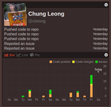

#### Recent activities

The **Recent activities** panel shows five of the user's recent actions. Actions
that took place today or yesterday will appear brighter than those further in
the past:

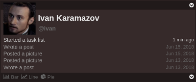

Click on a link to navigate to the corresponding story. Click the user's name to
see the full list starting from the top.

Clicking the user's @tag will initiate a search for stories where he's
mentioned.

#### User statistics

The **User statistics** panel shows the user's activities in the last 14 days.
The default view is a bar chart. You can switch between chart types using the
buttons on top:

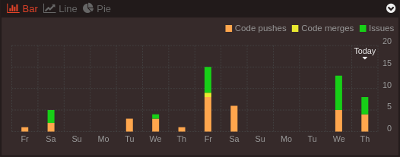

When the screen is narrow, the chart is hidden initially. You have to click one
of the chart button to show it. Click the same button second time to hide it
once more.

You can change the time range to the current month or the entire project
lifetime using the buttons in the actions panel or the pop-up menu:

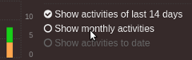 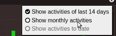

#### Actions

The **Actions** panel lets you contact another project member and see their
profiles on various social networks:

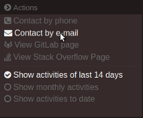

Contact information is hidden from guest users. They'll only see social-network
links.

## Settings

In the **Settings** page, you'll find various panels for adjusting application
parameters and entering personal information:

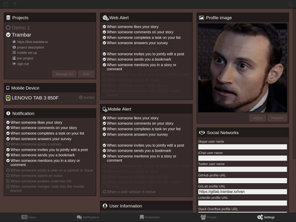

* [Projects](#project-panel)
* [Devices](#devices-panel)
* [Notification](#notification)
* [Web alert](#web-alert)
* [Mobile alert](#mobile)
* [User information](#user-information)
* [Profile image](#profile-image)
* [Social networks](#social-networks)
* [Language](#language)

### Projects

The **Projects** panel lets you quickly switch between projects:

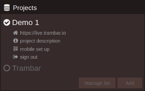

Click the **mobile set up** button when you wish to access the project using
the Trambar mobile app. A quickly scan of a QR code will tether the phone or
tablet to your account.

Click the **sign out** button when you want to end the user session. All data
from the server will be removed from your computer or mobile device. If you
only wish to remove a single project, click the **Manage list** button.

Click the **Add** button if you want to add another project to the list.

The Trambar mobile app can handle projects on multiple servers. When you jump
from one server to another, you will notice changes in the other panels.

### Devices

The **Devices** panel lists the mobile devices that are tethered to your
account:

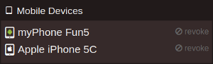

Click **revoke** if you wish to terminate access to a device, with the most
likely reason being the loss of that device.

### Notification

The **Notification** panel lets you decide for which events you'll be notified:

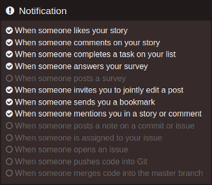

Notifications are shown in the [Notifications](#notifications) page. By default,
alerts are immediately sent to your web browser or phone. You can override this
behavior using the two panels below.

### Web alert

The **Web alert** panel lets you disable browser alert for certain events:

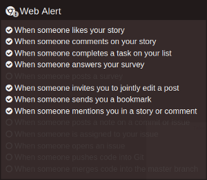

### Mobile alert

The **Web alert** panel lets you disable mobile alert for certain events:

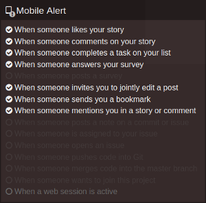

By default, Trambar will not send alerts to your phone when you're accessing
the system through a web browser. Check **When a web session is active** if you
wish to always receive alerts on your phone.

### User information

The **User information** panels lets you update your personal details:

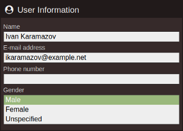

Gender is used for grammatical purpose only.

### Profile image

The **Profile image** panel lets you change or adjust your profile image:

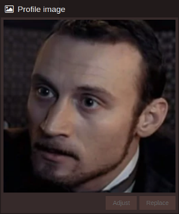

Click the **Replace** button if you want to use a new image. You can select an
image or take a photo using the camera.

Click the **Adjust** if you only wish to adjust the position or zoom level of
the current image.

### Social networks

The **Social networks** panel lets you add your contact info on social networks:

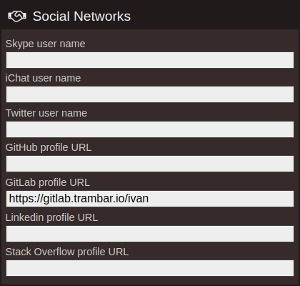

### Language

The **Language** panel is where you can set the language of the user interface:

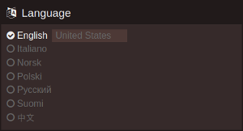

The region determines which dialect or script variant is used. For example,
when *United Kingdom* is selected, certain words will be spelled differently.
The calendar will also list Monday as the first day of the week instead of
Sunday.

## Calendar

The **Calendar** bar lets you see what happened on a particular day. Click on a
date to select it. If date is is grayed out, that means nothing occured on that
date.

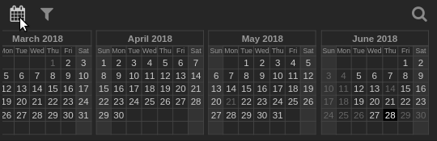

The [News](#news) page will show stories published on the selected date.

The [Notifications](#notifications) page will show notifications you received
on the selected date.

The [People](#people) page will list the project members who were active on that
day. Click on a name to see the full list of stories by that user. You can also
select a date by clicking a bar in the activity chart.

Click on the calendar icon a second time to retract the bar.

## Filters

The **Filters** bar lets you filter stories and users by roles.

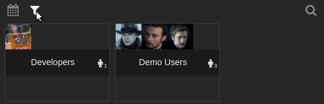

Click on a role to select it. Click it again to deselect it.

Click on the filter icon a second time to rectract the bar.

## Search

The **Search** bar lets you search for stories by keyword or by tag.

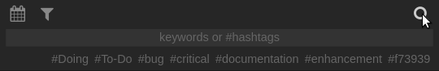

Beside (or below) the text box you will see a list of tags that were used
recently. Click on one to search by that tag.

The [People](#people) page will list the project members who have matching
stories. Click on a name to see the full list.

Search-by-tag is available when there's no Internet access. The search would be
conducted on the local cache. On the other hand, search-by-keyword requires
connection to the remote server.

Click on the magnifying glass icon a second time to retract the bar.
